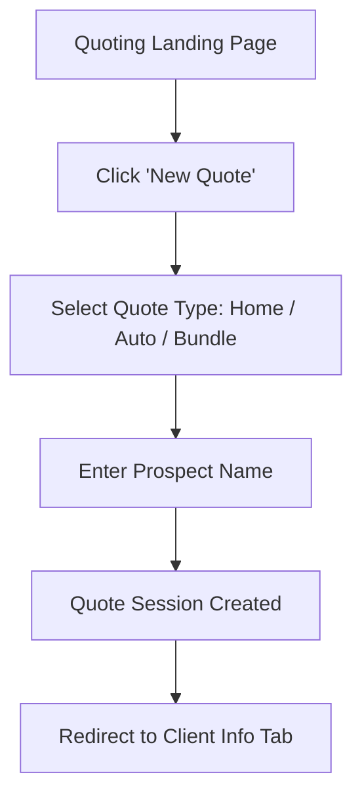
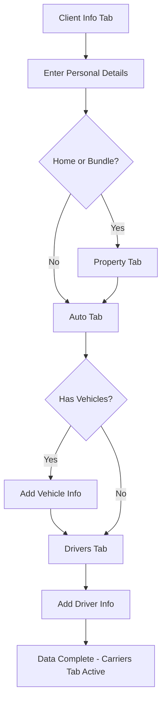
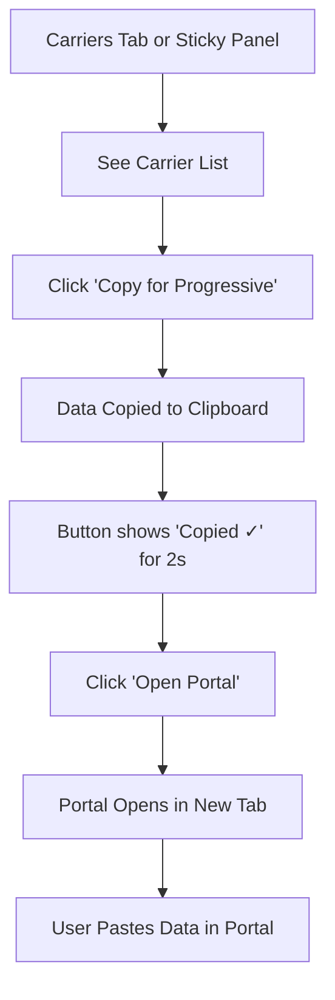
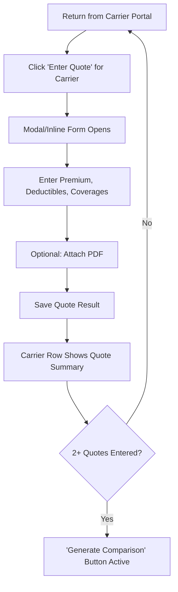
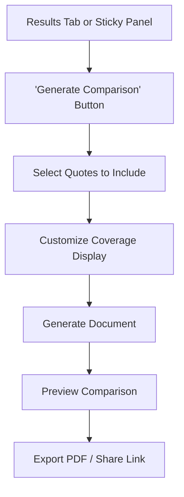

# Quoting Helper (Phase 3) UX Design Specification

_Created on 2025-12-10 by Sam_
_Generated using BMad Method - Create UX Design Workflow v1.0_

---

## Executive Summary

**Project:** Quoting Helper - A clipboard-based tool within docuMINE that enables insurance agents to enter client data once and copy carrier-formatted output to paste into any carrier portal.

**Target Users:** Independent insurance agents who quote 2-20 carriers per prospect and currently spend 45-60 minutes re-entering the same data across portals.

**Core Experience:** "Enter once, use everywhere" - The defining interaction is entering client data in a structured form, then clicking "Copy for [Carrier]" to get formatted data on clipboard.

**Desired Emotion:** Efficient and in control - agents should feel fast, productive, and confident.

**Platform:** Web app feature within existing docuMINE (desktop-first, tablet support).

**Design System:** Inherits docuMINE's existing design system (shadcn/ui, Electric Blue accent, slate neutrals).

---

## 1. Design System Foundation

### 1.1 Design System Choice

**Decision:** Use existing docuMINE design system (no new design system needed)

**Rationale:** Quoting Helper is a feature module within docuMINE, not a standalone app. Using the existing design system ensures:
- Visual consistency with rest of app
- Faster development (components already built)
- Familiar patterns for existing users
- No design system maintenance overhead

**Existing docuMINE Design System:**
- **Component Library:** shadcn/ui (Radix primitives + Tailwind)
- **Primary Color:** Electric Blue (`oklch(0.59 0.2 255)` / `#3b82f6`)
- **Neutrals:** Slate scale (backgrounds, text, borders)
- **Typography:** Geist Sans (--font-geist-sans)
- **Spacing:** Tailwind default (4px base unit)
- **Border Radius:** 0.625rem (10px) base

**Components Available:**
- Form inputs (Input, Select, Checkbox, Calendar)
- Buttons (primary, secondary, destructive, ghost)
- Cards, Tables, Tabs
- Dialog, Sheet, Popover
- Toast notifications (Sonner)
- Progress indicators, Skeletons
- Collapsible sections

---

## 2. Core User Experience

### 2.1 Defining Experience

**The One Thing:** "Click Copy, get carrier-formatted data on clipboard instantly."

This is a **workflow optimization tool** - the UX goal is to make a tedious task (re-entering data across portals) feel effortless. Every design decision should reduce friction in the enter-once-copy-many flow.

**Standard Patterns Apply:**
- Multi-section form entry (tabs or accordion)
- Action buttons with clear feedback
- List/table for session management
- Modal or inline for result entry

**No Novel Patterns Needed:** The interaction model (form → action → feedback) is well-established.

### 2.2 Core Experience Principles

| Principle | Application |
|-----------|-------------|
| **Speed** | Form loads fast, copy is instant, auto-save prevents re-work |
| **Guidance** | Clear progress through form sections, obvious next actions |
| **Flexibility** | Skip sections not needed (home-only, auto-only), edit anytime |
| **Feedback** | Immediate validation, satisfying copy confirmation, clear status |

---

## 3. Visual Foundation

### 3.1 Color System

**Inherited from docuMINE:**

| Token | Value | Usage |
|-------|-------|-------|
| `--primary` | Electric Blue `#3b82f6` | Primary buttons, links, focus rings |
| `--background` | White `#ffffff` | Page background |
| `--card` | Off-white `#fafafa` | Cards, elevated surfaces |
| `--foreground` | Near-black | Primary text |
| `--muted-foreground` | Slate-500 | Secondary text, placeholders |
| `--border` | Slate-200 | Borders, dividers |
| `--destructive` | Red | Delete actions, errors |

**Semantic Colors for Quoting:**

| State | Color | Usage |
|-------|-------|-------|
| **Success** | Green-500 | "Copied ✓" confirmation, quote entered |
| **Warning** | Amber-500 | Incomplete data, validation warnings |
| **Error** | Red-500 | Validation errors, failed actions |
| **Info** | Blue-500 | Tips, guidance |

### 3.2 Typography

**Inherited from docuMINE:**
- **Font Family:** Geist Sans
- **Headings:** font-semibold, text-lg/xl/2xl
- **Body:** font-normal, text-sm/base
- **Labels:** font-medium, text-sm
- **Monospace:** Geist Mono (for VIN, policy numbers)

### 3.3 Spacing & Layout

- **Base Unit:** 4px (Tailwind default)
- **Common Spacing:** 2 (8px), 4 (16px), 6 (24px), 8 (32px)
- **Card Padding:** p-4 to p-6
- **Form Field Gap:** space-y-4
- **Section Gap:** space-y-6 to space-y-8

---

## 4. Design Direction

### 4.1 Chosen Design Approach

**Direction:** Professional, Information-Dense, Efficient

**Layout Decisions:**
- **Navigation:** Sidebar (existing docuMINE pattern) with "Quoting" nav item
- **Page Structure:** Full-width content area with card-based sections
- **Form Layout:** Tab-based sections for Client Info, Property, Auto, Drivers
- **Density:** Balanced - not cramped, but not wasteful of space

**Visual Hierarchy:**
- **Primary Action:** "Copy for [Carrier]" buttons - large, prominent, Electric Blue
- **Secondary Action:** "Open Portal" links - ghost button style
- **Tertiary:** Section navigation, edit actions

**Information Architecture:**
```
/quoting (list view)
  └── New Quote Session
  └── Session Cards (prospect name, status, date, carriers)

/quoting/[id] (detail view)
  └── Header: Prospect Name, Status, Actions
  └── Tabs: Client Info | Property | Auto | Drivers | Carriers | Results
  └── Active Tab Content (form or summary)
  └── Sticky Footer: Carrier Action Panel (when data complete)
```

---

## 5. User Journey Flows

### 5.1 Critical User Paths

#### Journey 1: Create New Quote Session



**Design Notes:**
- "New Quote" button prominent on landing page
- Quote type selection can be modal or inline
- Minimal friction - just type and quote type to start

#### Journey 2: Enter Client Data (Core Flow)



**Design Notes:**
- Tabs show completion status (checkmark or count)
- Auto-save on field blur
- Validation inline as user types
- Skip button for non-applicable sections

#### Journey 3: Copy to Carrier (Magic Moment)



**Design Notes:**
- Carrier row: `[Logo] [Carrier Name] [Status] [Copy Button] [Open Portal]`
- Copy button: Primary style, shows "Copied ✓" with checkmark icon
- Open Portal: Ghost button with external link icon
- Copy feedback must be immediate and satisfying

#### Journey 4: Enter Quote Results



**Design Notes:**
- Quote entry can be modal (focused) or inline expansion
- Pre-populate coverage fields based on what was requested
- Show quote summary inline after entry (premium, key limits)

#### Journey 5: Generate Comparison



**Design Notes:**
- Button disabled until 2+ quotes entered
- Leverage existing docuMINE comparison infrastructure
- Quick generation - no long waits

---

## 6. Component Library

### 6.1 Component Strategy

**From shadcn/ui (no changes needed):**
- Button, Input, Select, Checkbox, Label
- Card, Tabs, Table
- Dialog, Sheet
- Toast (Sonner)
- Form (react-hook-form integration)

**Custom Components Needed:**

#### 6.1.1 CarrierActionRow

**Purpose:** Display a carrier with copy/portal actions

**Anatomy:**
- Carrier logo (24x24 or 32x32)
- Carrier name (text)
- Status badge (not started / copied / quote entered)
- Copy button (primary)
- Open Portal button (ghost, external link icon)

**States:**
- Default: Copy button enabled
- Copied: Button shows "Copied ✓" for 2 seconds, then resets
- Quote Entered: Shows premium, "Edit Quote" link

**Variants:**
- Compact (list view)
- Expanded (shows quote summary inline)

#### 6.1.2 QuoteSessionCard

**Purpose:** Display quote session in list view

**Anatomy:**
- Prospect name (title)
- Quote type badge (Home / Auto / Bundle)
- Status indicator (Draft / In Progress / Quotes Received / Complete)
- Date created/modified
- Carrier count ("3 carriers")
- Action menu (Edit, Duplicate, Delete)

**States:**
- Default: Clickable to open
- Hover: Subtle background change

#### 6.1.3 FormSectionTab

**Purpose:** Tab with completion indicator

**Anatomy:**
- Tab label
- Completion indicator (checkmark, count, or empty)
- Required indicator if applicable

**States:**
- Default: Inactive tab
- Active: Selected tab styling
- Complete: Shows checkmark
- Has Content: Shows count (e.g., "2 vehicles")

#### 6.1.4 CopyButton

**Purpose:** Button with copy-to-clipboard feedback

**Anatomy:**
- Icon (clipboard or carrier-specific)
- Label ("Copy for Progressive")
- Loading/copied state indicator

**States:**
- Default: "Copy for [Carrier]"
- Copying: Brief loading (if needed)
- Copied: "Copied ✓" with checkmark, green tint, 2 second duration
- Error: "Failed" with retry option

**Behavior:**
- Click → Copy to clipboard → Show success → Reset after 2s
- Keyboard accessible (Enter/Space)

---

## 7. UX Pattern Decisions

### 7.1 Consistency Rules

#### Button Hierarchy
| Type | Style | Usage |
|------|-------|-------|
| Primary | Solid Electric Blue | Copy to Carrier, Save, Generate Comparison |
| Secondary | Outline | Cancel, Back, Secondary actions |
| Ghost | Text only | Open Portal, Edit, View |
| Destructive | Solid Red | Delete session, Remove vehicle |

#### Feedback Patterns
| Event | Pattern |
|-------|---------|
| Copy Success | Button transforms: "Copied ✓" green for 2s |
| Save Success | Toast: "Session saved" (auto-dismiss 3s) |
| Validation Error | Inline under field, red text, icon |
| Form Incomplete | Tab shows indicator, gentle prompt |
| Quote Entered | Inline summary appears, success toast |

#### Form Patterns
| Pattern | Decision |
|---------|----------|
| Label Position | Above field (standard shadcn) |
| Required Indicator | Red asterisk (*) |
| Validation Timing | On blur + on submit |
| Error Display | Inline below field |
| Help Text | Muted text below field or tooltip |

#### Auto-Save Pattern
- Save on field blur (debounced 500ms)
- No explicit "Save" button for form data
- Visual indicator: "Saving..." → "Saved" (subtle, non-intrusive)
- If save fails: Show toast with retry

#### Empty States
| Context | Message | CTA |
|---------|---------|-----|
| No quote sessions | "No quotes yet. Start your first quote to save time on carrier portals." | "New Quote" button |
| No vehicles added | "No vehicles added yet." | "Add Vehicle" button |
| No quotes entered | "Get quotes from carriers, then enter results here to generate a comparison." | (Carriers tab link) |

#### Confirmation Patterns
| Action | Confirmation |
|--------|--------------|
| Delete session | Alert dialog: "Delete this quote session? This cannot be undone." |
| Delete vehicle/driver | Inline confirm or immediate with undo toast |
| Leave with unsaved | Auto-save handles this - no confirmation needed |
| Generate comparison | No confirmation - quick action |

---

## 8. Responsive Design & Accessibility

### 8.1 Responsive Strategy

**Breakpoints:**
| Breakpoint | Width | Layout |
|------------|-------|--------|
| Mobile | < 768px | Stacked, simplified (view-only for results) |
| Tablet | 768px - 1024px | Adjusted spacing, collapsible sections |
| Desktop | > 1024px | Full layout, tabs visible |

**Desktop (Primary):**
- Full sidebar navigation
- Tab-based form sections
- Carrier action panel always visible
- Multi-column forms where appropriate

**Tablet:**
- Collapsible sidebar
- Same tab structure, may need horizontal scroll
- Carrier panel may collapse to expandable section

**Mobile (View-Only Priority):**
- Bottom navigation or hamburger menu
- View quote sessions and results
- Data entry not optimized (agents use desktop)
- Copy buttons still functional

### 8.2 Accessibility

**Target:** WCAG 2.1 AA Compliance

**Requirements:**
| Requirement | Implementation |
|-------------|----------------|
| Color Contrast | 4.5:1 minimum for text (inherited from docuMINE) |
| Keyboard Navigation | All interactive elements focusable and operable |
| Focus Indicators | Visible focus ring (Electric Blue) |
| Form Labels | All inputs have associated labels |
| Error Messages | Linked to fields with aria-describedby |
| Screen Reader | Meaningful announcements for copy success, validation |
| Touch Targets | Minimum 44x44px on mobile |

**ARIA Patterns:**
- `aria-live="polite"` for copy success announcements
- `aria-invalid` and `aria-describedby` for form errors
- `role="tablist"` for form section tabs
- `aria-expanded` for collapsible sections

---

## 9. Screen-by-Screen Specifications

### 9.1 Quote Sessions List (`/quoting`)

**Purpose:** Landing page showing all quote sessions

**Layout:**
```
┌─────────────────────────────────────────────────────────────┐
│ Header: docuMINE                                    [User] │
├──────────┬──────────────────────────────────────────────────┤
│          │                                                  │
│ Sidebar  │  Quoting                          [+ New Quote] │
│          │  ─────────────────────────────────────────────── │
│ • Docs   │                                                  │
│ • Compare│  [Search...] [Filter: All ▼] [Sort: Recent ▼]   │
│ • Quote ←│                                                  │
│ • Chat   │  ┌─────────────────────────────────────────────┐ │
│          │  │ Johnson Family          [Bundle] [Draft]    │ │
│          │  │ Created Dec 10 • 0 carriers                 │ │
│          │  │                                    [⋮ Menu] │ │
│          │  └─────────────────────────────────────────────┘ │
│          │                                                  │
│          │  ┌─────────────────────────────────────────────┐ │
│          │  │ Smith Residence         [Home] [Complete]   │ │
│          │  │ Created Dec 8 • 3 quotes received           │ │
│          │  │                                    [⋮ Menu] │ │
│          │  └─────────────────────────────────────────────┘ │
│          │                                                  │
└──────────┴──────────────────────────────────────────────────┘
```

**Components:**
- Page header with "New Quote" button
- Search input
- Filter dropdown (All, Draft, In Progress, Complete)
- Sort dropdown (Recent, Name, Status)
- QuoteSessionCard grid or list

### 9.2 Quote Session Detail (`/quoting/[id]`)

**Purpose:** Data entry and carrier actions for a single quote

**Layout:**
```
┌─────────────────────────────────────────────────────────────┐
│ Header: docuMINE                                    [User] │
├──────────┬──────────────────────────────────────────────────┤
│          │                                                  │
│ Sidebar  │  ← Back to Quotes                               │
│          │                                                  │
│          │  Johnson Family                    [Bundle]     │
│          │  ─────────────────────────────────────────────── │
│          │                                                  │
│          │  [Client ✓] [Property ✓] [Auto 2] [Drivers 2]   │
│          │  [Carriers] [Results]                           │
│          │                                                  │
│          │  ┌─────────────────────────────────────────────┐ │
│          │  │                                             │ │
│          │  │  CLIENT INFORMATION                         │ │
│          │  │                                             │ │
│          │  │  Name ─────────────  DOB ──────────         │ │
│          │  │  [John Johnson    ]  [1985-03-15  ]         │ │
│          │  │                                             │ │
│          │  │  Email ────────────  Phone ────────         │ │
│          │  │  [john@email.com  ]  [(555) 123-4567]       │ │
│          │  │                                             │ │
│          │  │  Address ──────────────────────────         │ │
│          │  │  [123 Main Street, Austin, TX 78701]        │ │
│          │  │                                             │ │
│          │  └─────────────────────────────────────────────┘ │
│          │                                                  │
│          │  ┌─────────────────────────────────────────────┐ │
│          │  │ CARRIERS           Ready to quote!          │ │
│          │  │ ─────────────────────────────────────────── │ │
│          │  │ [P] Progressive    [Copy Data] [Open Portal]│ │
│          │  │ [T] Travelers      [Copy Data] [Open Portal]│ │
│          │  └─────────────────────────────────────────────┘ │
│          │                                                  │
└──────────┴──────────────────────────────────────────────────┘
```

**Tab Content Specifications:**

**Client Info Tab:**
- Full name, DOB, email, phone
- Mailing address (with autocomplete)
- Marital status, occupation (optional)

**Property Tab (if Home/Bundle):**
- Property address (may differ from mailing)
- Year built, square footage
- Construction type (dropdown)
- Roof type, roof year
- Coverage: Dwelling, Liability, Deductible
- Optional: Pool, trampoline, claims history

**Auto Tab (if Auto/Bundle):**
- Vehicle cards (add/remove)
- Each vehicle: Year, Make, Model, VIN
- Usage: Commute, Pleasure, Business
- Annual mileage
- Coverage: Liability, Comprehensive, Collision, Deductibles

**Drivers Tab:**
- Driver cards (add/remove)
- Each driver: Name, DOB, License #, State
- Years licensed, accidents, violations
- Relationship to primary

**Carriers Tab:**
- List of supported carriers
- Per-carrier: Logo, Name, Copy Button, Open Portal Button
- Status: Not started → Copied → Quote Entered

**Results Tab:**
- List of entered quotes
- Per-quote: Carrier, Premium, Key coverages, Attached PDF
- "Generate Comparison" button (enabled when 2+ quotes)

### 9.3 Carrier Action Panel (Sticky/Fixed)

**Purpose:** Always-visible carrier actions when data is complete

**Behavior:**
- Appears as sticky footer or fixed panel when core data is entered
- Shows carrier list with copy/portal actions
- Collapses on mobile to expandable button

**Layout:**
```
┌─────────────────────────────────────────────────────────────┐
│ Ready to quote! Copy data for your carriers:                │
│                                                             │
│ [P] Progressive  [✓ Copied]  [Open Portal ↗]               │
│ [T] Travelers    [Copy Data] [Open Portal ↗]               │
│                                                             │
│ [+ Add Carrier]                           [Enter Quotes →] │
└─────────────────────────────────────────────────────────────┘
```

---

## 10. Implementation Guidance

### 10.1 Component Priority

**Phase 1 - Core Flow:**
1. QuoteSessionCard (list page)
2. Form sections (Client, Property, Auto, Drivers)
3. CopyButton with feedback
4. CarrierActionRow

**Phase 2 - Results & Comparison:**
5. Quote result entry form/modal
6. Results summary display
7. Comparison generation integration

**Phase 3 - Polish:**
8. Search/filter for sessions
9. Duplicate session
10. Mobile optimizations

### 10.2 Key Implementation Notes

**Clipboard Copy:**
```typescript
// Use Clipboard API with fallback
async function copyToClipboard(text: string): Promise<boolean> {
  try {
    await navigator.clipboard.writeText(text);
    return true;
  } catch {
    // Fallback for older browsers
    const textarea = document.createElement('textarea');
    textarea.value = text;
    document.body.appendChild(textarea);
    textarea.select();
    const success = document.execCommand('copy');
    document.body.removeChild(textarea);
    return success;
  }
}
```

**Copy Button State:**
- Use local state for "copied" feedback
- Reset after 2 seconds with setTimeout
- Announce to screen readers with aria-live

**Auto-Save:**
- Debounce 500ms on field blur
- Use optimistic UI (show "Saved" immediately)
- Queue failed saves for retry
- No blocking - user can keep typing

**Carrier Data Formatting:**
- Create formatter function per carrier
- Return tab-delimited text for easy paste
- Include field labels for context

---

## Appendix

### Related Documents

- PRD: `docs/features/quoting/prd.md`
- Brainstorm: `docs/features/documine-suite-brainstorm-2025-12-07.md`

### Version History

| Date | Version | Changes | Author |
|------|---------|---------|--------|
| 2025-12-10 | 1.0 | Initial UX Design Specification | Sam |

---

_This UX Design Specification was created through collaborative design facilitation. All decisions align with the existing docuMINE design system and PRD requirements._
