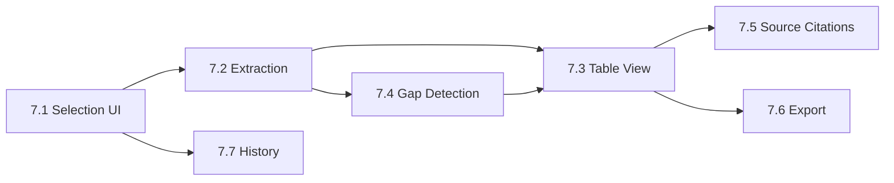

# Traceability Mapping

## FR → Story → AC Mapping

| FR | Description | Story | Acceptance Criteria |
|----|-------------|-------|---------------------|
| FR20 | Select 2-4 documents for comparison | 7.1 | AC-7.1.1, AC-7.1.2, AC-7.1.3, AC-7.1.4, AC-7.1.5 |
| FR21 | Auto-extract quote data | 7.2 | AC-7.2.1, AC-7.2.2, AC-7.2.3, AC-7.2.4 |
| FR22 | Aligned comparison view | 7.3 | AC-7.3.1, AC-7.3.2, AC-7.3.3 |
| FR23 | Highlight differences | 7.3 | AC-7.3.4, AC-7.3.5, AC-7.3.6 |
| FR24 | Flag gaps/conflicts | 7.4 | AC-7.4.1, AC-7.4.2, AC-7.4.3, AC-7.4.4, AC-7.4.6 |
| FR25 | Source citations for comparison | 7.5 | AC-7.5.1, AC-7.5.2, AC-7.5.3, AC-7.5.4 |
| FR26 | Export comparison results | 7.6 | AC-7.6.1, AC-7.6.2, AC-7.6.3, AC-7.6.4, AC-7.6.5 |
| FR27 | Comparison history & management | 7.7 | AC-7.7.1, AC-7.7.2, AC-7.7.3, AC-7.7.4, AC-7.7.5, AC-7.7.6, AC-7.7.7, AC-7.7.8 |

## Story Dependencies

## Implementation Order

1. **Story 7.1** - Selection UI + database migration (foundation)
2. **Story 7.2** - Extraction service (core logic)
3. **Story 7.3** - Table view (depends on extraction)
4. **Story 7.4** - Gap detection (enhances table)
5. **Story 7.5** - Source citations (builds on table)
6. **Story 7.6** - Export (builds on table)
7. **Story 7.7** - Comparison history (depends on comparisons table from 7.1)
