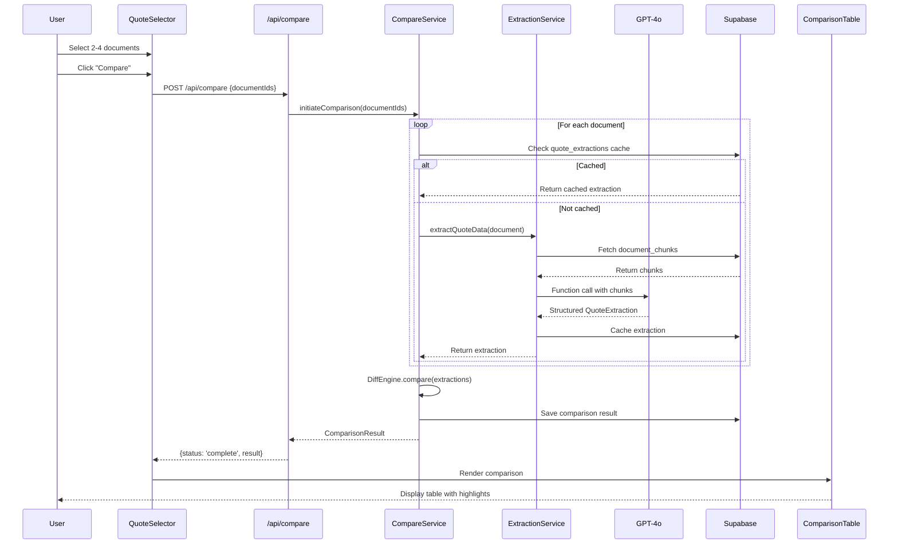
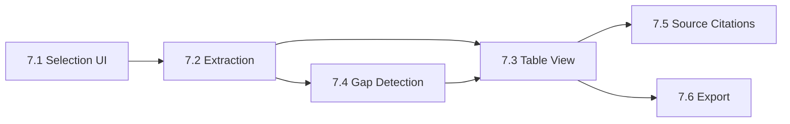

# Epic Technical Specification: Quote Comparison

Date: 2025-12-03
Author: Sam
Epic ID: 7
Status: Draft

---

## Overview

Epic 7 delivers the second core pillar of docuMINE's value proposition: side-by-side quote comparison for insurance documents. While Epic 5 enabled agents to interrogate individual documents, this epic enables them to compare multiple carrier quotes simultaneously—a daily workflow that currently involves tedious manual spreadsheet work.

The comparison feature automatically extracts structured data from 2-4 insurance quote documents (coverage types, limits, deductibles, exclusions, premiums), displays them in an aligned table view, highlights differences, identifies coverage gaps/conflicts, and allows verification of any extracted value via source citations. This maintains the trust-transparent approach established in Epic 5: every extracted data point is verifiable.

This epic builds directly on the document processing infrastructure from Epic 4 (Docling parsing, chunking, embeddings) and the RAG pipeline from Epic 5 (retrieval, Claude integration). The novel component is GPT-4o function calling for structured data extraction from insurance quotes.

## Objectives and Scope

### In Scope

- **Quote Selection Interface** (Story 7.1) - UI for selecting 2-4 documents for comparison, with upload capability for new quotes
- **Structured Data Extraction** (Story 7.2) - GPT-4o function calling to extract coverage types, limits, deductibles, exclusions, premiums, carrier names, effective dates
- **Comparison Table View** (Story 7.3) - Side-by-side table with difference highlighting, best/worst value indicators
- **Gap & Conflict Detection** (Story 7.4) - Automatic identification of missing coverage, exclusion differences, significant limit/deductible variances
- **Source Citations** (Story 7.5) - Click-to-verify for any extracted value, reusing document viewer highlight pattern
- **Export Functionality** (Story 7.6) - PDF and CSV export of comparison results

### Out of Scope

- **Multi-policy comparison** - Only quote documents, not full policies (post-MVP)
- **Historical comparison** - No tracking of quote changes over time
- **Recommendation engine** - No AI-suggested "best quote" (agents make decisions)
- **Carrier-specific parsers** - Generic extraction, no carrier-specific optimization
- **Comparison templates** - No saved comparison configurations
- **Sharing/collaboration** - No multi-user comparison sessions

## System Architecture Alignment

### Components Referenced

| Component | Usage | Source |
|-----------|-------|--------|
| Document Processing | Docling-parsed content as extraction context | Epic 4, ADR-002 |
| Vector Search | Retrieve relevant chunks for extraction prompts | Epic 5, Architecture RAG Pipeline |
| GPT-5.1 Function Calling | Structured data extraction with CFG constraints (400K context) | New for Epic 7, ADR-007 |
| Claude Sonnet 4.5 via OpenRouter | Alternative extraction model if needed | ADR-005 |
| PDF Viewer | Source citation navigation | Epic 5, Story 5.5 |
| Supabase Storage | Quote document storage | Epic 1, Story 1.4 |
| RLS Policies | Agency-scoped comparison data | Epic 1, Story 1.2 |

### Architectural Constraints

1. **Agency Isolation** - Comparisons are agency-scoped; users can only compare documents within their agency
2. **Document Readiness** - Only documents with status='ready' can be selected for comparison
3. **Extraction Caching** - Extracted data cached to avoid re-extraction on same document
4. **Trust Transparency** - Every extracted value must store source reference (page number, text excerpt)
5. **Response Time** - Extraction should complete within 60 seconds per document (NFR4)

## Detailed Design

### Services and Modules

| Module | Responsibility | Location | Dependencies |
|--------|---------------|----------|--------------|
| **CompareService** | Orchestrates comparison workflow: document selection, extraction, diff generation | `src/lib/compare/service.ts` | ExtractionService, DiffEngine |
| **ExtractionService** | GPT-4o function calling for structured data extraction from chunks | `src/lib/compare/extraction.ts` | OpenAI client, document_chunks |
| **DiffEngine** | Computes differences, identifies gaps/conflicts, determines best/worst values | `src/lib/compare/diff.ts` | Pure functions, no external deps |
| **CompareAPI** | REST endpoints for compare operations | `src/app/api/compare/route.ts` | CompareService, auth middleware |
| **QuoteSelectionUI** | Document selection interface with upload integration | `src/components/compare/quote-selector.tsx` | DocumentList, UploadZone |
| **ComparisonTableUI** | Renders comparison table with highlighting | `src/components/compare/comparison-table.tsx` | DiffEngine output |
| **ExportService** | PDF and CSV generation | `src/lib/compare/export.ts` | react-pdf, Blob API |

**Module Interaction Flow:**
```
QuoteSelectionUI → CompareAPI → CompareService
                                    ↓
                            ExtractionService (per doc)
                                    ↓
                              DiffEngine
                                    ↓
                            ComparisonTableUI
                                    ↓
                            ExportService (on demand)
```

### Data Models and Contracts

#### Database Schema

```sql
-- Quote extraction cache (avoids re-extraction)
CREATE TABLE quote_extractions (
  id UUID PRIMARY KEY DEFAULT gen_random_uuid(),
  document_id UUID NOT NULL REFERENCES documents(id) ON DELETE CASCADE,
  agency_id UUID NOT NULL REFERENCES agencies(id),
  extracted_data JSONB NOT NULL,  -- QuoteExtraction type
  extraction_version INTEGER DEFAULT 1,  -- For schema migrations
  created_at TIMESTAMPTZ DEFAULT now(),
  updated_at TIMESTAMPTZ DEFAULT now(),
  UNIQUE(document_id, extraction_version)
);

-- Comparison sessions
CREATE TABLE comparisons (
  id UUID PRIMARY KEY DEFAULT gen_random_uuid(),
  agency_id UUID NOT NULL REFERENCES agencies(id),
  user_id UUID NOT NULL REFERENCES users(id),
  document_ids UUID[] NOT NULL,  -- Array of 2-4 document IDs
  comparison_data JSONB NOT NULL,  -- ComparisonResult type
  created_at TIMESTAMPTZ DEFAULT now()
);

-- RLS Policies
ALTER TABLE quote_extractions ENABLE ROW LEVEL SECURITY;
ALTER TABLE comparisons ENABLE ROW LEVEL SECURITY;

CREATE POLICY "Users can access own agency extractions"
  ON quote_extractions FOR ALL
  USING (agency_id = (SELECT agency_id FROM users WHERE id = auth.uid()));

CREATE POLICY "Users can access own agency comparisons"
  ON comparisons FOR ALL
  USING (agency_id = (SELECT agency_id FROM users WHERE id = auth.uid()));
```

#### TypeScript Types

```typescript
// src/types/compare.ts

// GPT-4o function calling schema
interface QuoteExtraction {
  carrierName: string | null;
  namedInsured: string | null;
  effectiveDate: string | null;  // ISO date
  expirationDate: string | null;
  annualPremium: number | null;
  coverages: CoverageItem[];
  exclusions: ExclusionItem[];
  extractionConfidence: number;  // 0-1
}

interface CoverageItem {
  type: CoverageType;
  limit: number | null;
  limitType: 'per_occurrence' | 'aggregate' | 'per_person' | 'combined_single';
  deductible: number | null;
  sourceRef: SourceReference;
}

type CoverageType =
  | 'general_liability'
  | 'property'
  | 'auto_liability'
  | 'auto_physical_damage'
  | 'umbrella'
  | 'workers_comp'
  | 'professional_liability'
  | 'cyber'
  | 'other';

interface ExclusionItem {
  description: string;
  category: 'flood' | 'earthquake' | 'pollution' | 'mold' | 'cyber' | 'employment' | 'other';
  sourceRef: SourceReference;
}

interface SourceReference {
  pageNumber: number;
  textExcerpt: string;  // 100-200 chars
  chunkId: string;
}

// Comparison result
interface ComparisonResult {
  documents: DocumentSummary[];
  rows: ComparisonRow[];
  gaps: GapWarning[];
  conflicts: ConflictWarning[];
  generatedAt: string;
}

interface ComparisonRow {
  field: string;
  fieldType: 'coverage_limit' | 'deductible' | 'premium' | 'date' | 'text' | 'exclusion';
  values: CellValue[];  // One per document
  hasDifference: boolean;
  bestIndex: number | null;   // Index of best value (null if N/A)
  worstIndex: number | null;  // Index of worst value
}

interface CellValue {
  displayValue: string;
  rawValue: number | string | null;
  sourceRef: SourceReference | null;
  status: 'found' | 'not_found' | 'inferred';
}

interface GapWarning {
  field: string;
  documentsMissing: number[];  // Indices
  documentsPresent: number[];
  severity: 'high' | 'medium' | 'low';
}

interface ConflictWarning {
  field: string;
  description: string;
  documentIndices: number[];
  severity: 'high' | 'medium';
}
```

### APIs and Interfaces

#### REST API Endpoints

```typescript
// POST /api/compare
// Initiates comparison for selected documents
interface CompareRequest {
  documentIds: string[];  // 2-4 UUIDs
}

interface CompareResponse {
  comparisonId: string;
  status: 'processing' | 'complete' | 'failed';
  result?: ComparisonResult;
  error?: { code: string; message: string };
}

// GET /api/compare/:id
// Retrieves existing comparison (for polling or reload)
// Response: CompareResponse

// GET /api/compare/:id/export?format=pdf|csv
// Generates and returns export file
// Response: Blob (application/pdf or text/csv)

// GET /api/documents/:id/extraction
// Get cached extraction for single document (or trigger if not cached)
interface ExtractionResponse {
  documentId: string;
  extraction: QuoteExtraction | null;
  status: 'cached' | 'processing' | 'failed';
  cachedAt?: string;
}
```

#### GPT-4o Function Calling Schema

```typescript
// Used in ExtractionService for structured output
const extractQuoteDataFunction = {
  name: 'extract_quote_data',
  description: 'Extract structured insurance quote data from document content',
  parameters: {
    type: 'object',
    properties: {
      carrierName: { type: 'string', description: 'Insurance carrier/company name' },
      namedInsured: { type: 'string', description: 'Policyholder name' },
      effectiveDate: { type: 'string', description: 'Policy effective date (YYYY-MM-DD)' },
      expirationDate: { type: 'string', description: 'Policy expiration date (YYYY-MM-DD)' },
      annualPremium: { type: 'number', description: 'Total annual premium in USD' },
      coverages: {
        type: 'array',
        items: {
          type: 'object',
          properties: {
            type: { type: 'string', enum: ['general_liability', 'property', 'auto_liability', ...] },
            limit: { type: 'number', description: 'Coverage limit in USD' },
            limitType: { type: 'string', enum: ['per_occurrence', 'aggregate', 'per_person', 'combined_single'] },
            deductible: { type: 'number', description: 'Deductible in USD' },
            pageNumber: { type: 'integer', description: 'Page where this coverage is defined' },
            sourceText: { type: 'string', description: 'Exact text from document (100-200 chars)' }
          },
          required: ['type', 'limit', 'pageNumber', 'sourceText']
        }
      },
      exclusions: {
        type: 'array',
        items: {
          type: 'object',
          properties: {
            description: { type: 'string', description: 'Exclusion description' },
            category: { type: 'string', enum: ['flood', 'earthquake', 'pollution', 'mold', 'cyber', 'employment', 'other'] },
            pageNumber: { type: 'integer' },
            sourceText: { type: 'string' }
          },
          required: ['description', 'category', 'pageNumber']
        }
      }
    },
    required: ['carrierName', 'coverages']
  }
};
```

#### Component Props

```typescript
// QuoteSelector component
interface QuoteSelectorProps {
  onCompare: (documentIds: string[]) => void;
  maxSelections?: number;  // Default 4
  minSelections?: number;  // Default 2
}

// ComparisonTable component
interface ComparisonTableProps {
  result: ComparisonResult;
  onCellClick: (documentIndex: number, field: string, sourceRef: SourceReference) => void;
  onExport: (format: 'pdf' | 'csv') => void;
}

// GapWarningBanner component
interface GapWarningBannerProps {
  gaps: GapWarning[];
  conflicts: ConflictWarning[];
  onGapClick: (gap: GapWarning) => void;  // Scroll to row
}
```

### Workflows and Sequencing

#### Comparison Flow Sequence Diagram



#### Extraction Flow Detail

```
1. Fetch all document_chunks for document (ordered by page, chunk_index)
2. Concatenate chunk content into context window (~400K tokens max with GPT-5.1)
3. Build extraction prompt:
   - System: "You are an insurance document analyst..."
   - User: Document content + "Extract quote data per schema"
   - Tools: [extractQuoteDataFunction with CFG constraints]
4. Call GPT-5.1 with tool_choice: { type: 'function', function: { name: 'extract_quote_data' } }
5. Parse function response as QuoteExtraction
6. Validate required fields present
7. Cache in quote_extractions table
8. Return extraction with source references
```

#### Gap Detection Algorithm

```typescript
function detectGaps(extractions: QuoteExtraction[]): GapWarning[] {
  const gaps: GapWarning[] = [];
  const allCoverageTypes = new Set<CoverageType>();

  // Collect all coverage types across all quotes
  extractions.forEach(e => e.coverages.forEach(c => allCoverageTypes.add(c.type)));

  // Check each type for gaps
  allCoverageTypes.forEach(type => {
    const present = extractions.map((e, i) =>
      e.coverages.some(c => c.type === type) ? i : -1
    ).filter(i => i >= 0);

    const missing = extractions.map((_, i) => i).filter(i => !present.includes(i));

    if (missing.length > 0 && present.length > 0) {
      gaps.push({
        field: formatCoverageType(type),
        documentsMissing: missing,
        documentsPresent: present,
        severity: getCoverageSeverity(type)  // 'high' for GL, property; 'medium' for others
      });
    }
  });

  return gaps;
}
```

#### Best/Worst Value Logic

| Field Type | Best = | Worst = |
|------------|--------|---------|
| Coverage Limit | Highest | Lowest |
| Deductible | Lowest | Highest |
| Premium | Lowest | Highest |
| Exclusion Count | Fewest | Most |

Values marked `not_found` are excluded from best/worst comparison.

## Non-Functional Requirements

### Performance

| Metric | Target | Measurement |
|--------|--------|-------------|
| Extraction time per document | < 60 seconds | Timed from API call to extraction complete |
| Comparison generation (cached) | < 2 seconds | All extractions cached, only diff generation |
| Comparison generation (uncached, 4 docs) | < 4 minutes | Parallel extraction + diff |
| Table render time | < 500ms | Time from data received to DOM painted |
| Export generation (PDF) | < 10 seconds | Time from click to download |
| Export generation (CSV) | < 1 second | Client-side generation |

**Optimization Strategies:**
- Parallel extraction: Extract all documents concurrently (Promise.all)
- Extraction caching: Cache by document_id + extraction_version
- Lazy loading: Load document viewer only when source citation clicked
- Streaming progress: Show per-document extraction status as each completes

### Security

| Requirement | Implementation |
|-------------|----------------|
| Agency isolation | RLS policies on quote_extractions, comparisons tables |
| Document access | Validate all documentIds belong to user's agency before extraction |
| API authentication | Require valid session for all /api/compare endpoints |
| Input validation | Zod schema validation on all requests |
| Injection prevention | Parameterized queries only, no raw SQL |
| Rate limiting | Max 10 comparisons per hour per agency (prevent GPT cost abuse) |

**GPT-4o Cost Controls:**
- Extraction caching prevents re-extraction
- Rate limiting prevents abuse
- Max 4 documents per comparison limits per-request cost
- Estimated cost: ~$0.10-0.30 per document extraction (depending on size)

### Reliability/Availability

| Scenario | Handling |
|----------|----------|
| GPT-4o timeout | Retry once with exponential backoff, then mark extraction failed |
| GPT-4o rate limit | Queue extraction, retry after cooldown |
| Partial extraction failure | Return partial comparison with failed documents marked |
| Database unavailable | Return 503, no data loss (stateless extraction) |
| Export generation failure | Retry, show error toast if persistent |

**Fallback Strategy:**
- If GPT-4o unavailable, attempt extraction with Claude Sonnet 4.5 via OpenRouter
- Extraction schema compatible with both models

### Observability

| Log Event | Data Captured |
|-----------|---------------|
| `compare.initiated` | comparisonId, documentIds, userId, agencyId |
| `extraction.started` | documentId, chunkCount |
| `extraction.completed` | documentId, duration, tokenCount, fieldCount |
| `extraction.failed` | documentId, error, retryCount |
| `compare.completed` | comparisonId, duration, gapCount, conflictCount |
| `export.generated` | comparisonId, format, fileSize |

**Metrics Dashboard (Post-MVP):**
- Extraction success rate
- Average extraction time by document size
- Most common coverage types extracted
- Gap detection frequency

## Dependencies and Integrations

### External Dependencies

| Dependency | Purpose | Fallback |
|------------|---------|----------|
| **OpenAI GPT-5.1** | Structured data extraction via function calling (400K context, CFG) | Claude Sonnet 4.5 via OpenRouter |
| **Supabase** | Database, storage, auth, RLS | None (core infrastructure) |
| **react-pdf** | PDF export generation | @react-pdf/renderer |

### Internal Dependencies (Existing Components)

| Component | Location | Usage in Epic 7 |
|-----------|----------|-----------------|
| Document list/cards | `src/components/documents/` | QuoteSelector reuses DocumentCard |
| Upload zone | `src/components/documents/upload-zone.tsx` | Upload new quotes in compare flow |
| Document viewer | `src/components/documents/document-viewer.tsx` | Source citation navigation |
| Highlight logic | `src/hooks/use-document-highlight.ts` | Reuse for source verification |
| Auth middleware | `src/middleware.ts` | Protect compare routes |
| Supabase clients | `src/lib/supabase/` | Database operations |
| Logger | `src/lib/utils/logger.ts` | Structured logging |

### New Dependencies to Add

```json
// package.json additions
{
  "dependencies": {
    "@react-pdf/renderer": "^3.4.4",  // PDF export
    "file-saver": "^2.0.5"            // CSV download
  },
  "devDependencies": {
    "@types/file-saver": "^2.0.7"
  }
}
```

### Migration Dependencies

Story 7.1 requires database migration:
- `quote_extractions` table
- `comparisons` table
- RLS policies

Must be applied before any other Epic 7 stories.

## Acceptance Criteria (Authoritative)

### Story 7.1: Quote Selection Interface

| ID | Criterion |
|----|-----------|
| AC-7.1.1 | Compare page (`/compare`) shows document cards with selection checkboxes |
| AC-7.1.2 | Only documents with status='ready' are selectable |
| AC-7.1.3 | Selection count displayed: "X of 4 selected" |
| AC-7.1.4 | Compare button disabled until 2+ documents selected |
| AC-7.1.5 | Compare button disabled and tooltip shown when 5th document attempted |
| AC-7.1.6 | "Upload new quotes" opens upload zone; new docs appear in selection |
| AC-7.1.7 | Clicking Compare navigates to comparison view with loading state |

### Story 7.2: Quote Data Extraction

| ID | Criterion |
|----|-----------|
| AC-7.2.1 | Extraction uses GPT-5.1 function calling with defined schema (CFG constraints) |
| AC-7.2.2 | carrierName, coverages array extracted from each document |
| AC-7.2.3 | Each coverage item includes type, limit, deductible, sourceRef |
| AC-7.2.4 | Exclusions extracted with category classification |
| AC-7.2.5 | Extraction results cached in quote_extractions table |
| AC-7.2.6 | Subsequent comparisons use cache (no re-extraction) |
| AC-7.2.7 | Extraction completes within 60 seconds per document |
| AC-7.2.8 | Failed extraction returns partial result with error indicator |

### Story 7.3: Comparison Table View

| ID | Criterion |
|----|-----------|
| AC-7.3.1 | Table displays columns: Field, Quote 1, Quote 2, [Quote 3], [Quote 4] |
| AC-7.3.2 | Column headers show carrier names |
| AC-7.3.3 | Rows cover: all coverage types, deductibles, premium, effective dates |
| AC-7.3.4 | Best value in row marked with green indicator (●) |
| AC-7.3.5 | Worst value in row marked with red indicator (○) |
| AC-7.3.6 | Rows with differences have subtle highlight |
| AC-7.3.7 | "Not found" cells display "—" in muted text |
| AC-7.3.8 | Table has sticky header and first column |

### Story 7.4: Gap & Conflict Identification

| ID | Criterion |
|----|-----------|
| AC-7.4.1 | Gaps identified when coverage present in some quotes but missing in others |
| AC-7.4.2 | Gap rows show warning icon (⚠) and amber background |
| AC-7.4.3 | Conflicts identified for exclusion differences (e.g., flood excluded vs included) |
| AC-7.4.4 | Summary banner: "X potential gaps, Y conflicts identified" |
| AC-7.4.5 | Clicking summary item scrolls to relevant row |
| AC-7.4.6 | Severity levels (high/medium/low) based on coverage type |

### Story 7.5: Source Citations in Comparison

| ID | Criterion |
|----|-----------|
| AC-7.5.1 | Each cell with extracted value has "View source" link/icon |
| AC-7.5.2 | Clicking source opens document viewer modal |
| AC-7.5.3 | Document viewer scrolls to relevant page |
| AC-7.5.4 | Source passage highlighted with yellow background |
| AC-7.5.5 | Inferred values (no direct source) show "Inferred" tooltip |

### Story 7.6: Export Comparison Results

| ID | Criterion |
|----|-----------|
| AC-7.6.1 | Export dropdown offers PDF and CSV options |
| AC-7.6.2 | PDF includes: header, date, carrier names, full table, gaps summary |
| AC-7.6.3 | PDF highlights preserved (best/worst indicators) |
| AC-7.6.4 | CSV contains all data in tabular format |
| AC-7.6.5 | File downloads automatically with timestamp filename |
| AC-7.6.6 | Export button shows loading state during generation |

## Traceability Mapping

### FR → Story → AC Mapping

| FR | Description | Story | Acceptance Criteria |
|----|-------------|-------|---------------------|
| FR20 | Select 2-4 documents for comparison | 7.1 | AC-7.1.1, AC-7.1.2, AC-7.1.3, AC-7.1.4, AC-7.1.5 |
| FR21 | Auto-extract quote data | 7.2 | AC-7.2.1, AC-7.2.2, AC-7.2.3, AC-7.2.4 |
| FR22 | Aligned comparison view | 7.3 | AC-7.3.1, AC-7.3.2, AC-7.3.3 |
| FR23 | Highlight differences | 7.3 | AC-7.3.4, AC-7.3.5, AC-7.3.6 |
| FR24 | Flag gaps/conflicts | 7.4 | AC-7.4.1, AC-7.4.2, AC-7.4.3, AC-7.4.4, AC-7.4.6 |
| FR25 | Source citations for comparison | 7.5 | AC-7.5.1, AC-7.5.2, AC-7.5.3, AC-7.5.4 |
| FR26 | Export comparison results | 7.6 | AC-7.6.1, AC-7.6.2, AC-7.6.3, AC-7.6.4, AC-7.6.5 |

### Story Dependencies



### Implementation Order

1. **Story 7.1** - Selection UI + database migration (foundation)
2. **Story 7.2** - Extraction service (core logic)
3. **Story 7.3** - Table view (depends on extraction)
4. **Story 7.4** - Gap detection (enhances table)
5. **Story 7.5** - Source citations (builds on table)
6. **Story 7.6** - Export (builds on table)

## Risks, Assumptions, Open Questions

### Risks

| Risk | Likelihood | Impact | Mitigation |
|------|------------|--------|------------|
| **Extraction accuracy varies by carrier format** | High | Medium | Test with diverse quote samples; allow manual override post-MVP |
| **GPT-4o cost exceeds budget** | Medium | High | Extraction caching, rate limiting, cost monitoring alerts |
| **Large documents exceed context window** | Low | Medium | Truncate to first 100K tokens; summarization fallback |
| **PDF export rendering issues** | Medium | Low | Use well-tested @react-pdf/renderer; test across browsers |
| **Exclusion categorization errors** | Medium | Medium | Conservative "other" category; refinement in post-MVP |

### Assumptions

1. **Document Quality** - Uploaded quotes are readable PDFs with text layer (not scanned images)
2. **Coverage Standardization** - Insurance terminology follows industry conventions (per ISO forms)
3. **Single Policy per Document** - Each quote document contains one policy proposal
4. **English Language** - All documents are in English (i18n out of scope for MVP)
5. **Agency Data Isolation** - RLS policies from Epic 1 continue to function correctly

### Open Questions

| Question | Decision Needed By | Default If Unresolved |
|----------|--------------------|-----------------------|
| Should extraction run at upload time or on-demand? | Story 7.2 start | On-demand (simpler) |
| Maximum documents per comparison: 4 or 6? | Story 7.1 start | 4 (per PRD) |
| Export format: PDF only or also XLSX? | Story 7.6 start | PDF + CSV (XLSX post-MVP) |
| Cache invalidation strategy when document re-processed? | Story 7.2 | extraction_version increment |
| Should comparison history be saved? | Epic 7 complete | Save for 30 days |

### Resolved Decisions

| Decision | Choice | Rationale |
|----------|--------|-----------|
| Extraction model | GPT-5.1 | 400K context, CFG support, best structured output; fallback to Claude via OpenRouter (ADR-007) |
| PDF library | @react-pdf/renderer | Well-maintained, React-native compatible |
| Gap severity algorithm | Coverage type-based | GL/Property = high, others = medium |
| Best/worst highlighting | Green ●, Red ○ | Consistent with UX spec color semantics |

## Test Strategy Summary

### Unit Tests

| Component | Test Focus | Location |
|-----------|------------|----------|
| DiffEngine | Best/worst calculation, gap detection, conflict identification | `__tests__/lib/compare/diff.test.ts` |
| ExtractionService | Schema validation, source reference extraction | `__tests__/lib/compare/extraction.test.ts` |
| CompareService | Orchestration, caching logic, error handling | `__tests__/lib/compare/service.test.ts` |
| Type guards | QuoteExtraction, ComparisonResult validation | `__tests__/types/compare.test.ts` |

### Integration Tests

| Flow | Test Scenario |
|------|---------------|
| Compare API | POST /api/compare with valid documents returns comparison |
| Compare API | POST with invalid documentIds returns 400 |
| Compare API | POST with documents from other agency returns 403 |
| Extraction | Cached extraction returned on second request |
| Export | GET /api/compare/:id/export?format=pdf returns valid PDF |

### E2E Tests (Playwright)

| Test | Steps |
|------|-------|
| `compare-flow.spec.ts` | Navigate to /compare → Select 2 docs → Click Compare → Verify table renders |
| `compare-selection.spec.ts` | Try to select 5 docs → Verify blocked at 4 |
| `compare-source-citation.spec.ts` | Click cell source → Verify document viewer opens at page |
| `compare-export.spec.ts` | Click Export PDF → Verify download triggers |
| `compare-gaps.spec.ts` | Compare docs with gap → Verify warning banner appears |

### Test Data

**Quote Samples for Testing:**

| Sample | Purpose | Characteristics |
|--------|---------|-----------------|
| `hartford-gl-sample.pdf` | Standard GL quote | All fields present, clean format |
| `travelers-package.pdf` | Package policy | Multiple coverage types |
| `liberty-minimal.pdf` | Minimal quote | Missing several fields |
| `acme-nonstandard.pdf` | Edge case | Unusual format, tests extraction resilience |

**Test Extraction Assertions:**

```typescript
// Example test case for extraction
const hartfordExtraction = await extractQuoteData(hartfordDoc);
expect(hartfordExtraction.carrierName).toBe('Hartford');
expect(hartfordExtraction.coverages).toHaveLength(3);
expect(hartfordExtraction.coverages[0].type).toBe('general_liability');
expect(hartfordExtraction.coverages[0].limit).toBe(1000000);
expect(hartfordExtraction.coverages[0].sourceRef.pageNumber).toBe(2);
```

### Manual Testing Checklist

- [ ] Compare 2 quotes from different carriers
- [ ] Compare 4 quotes (maximum)
- [ ] Verify best/worst highlighting is correct
- [ ] Click source citation → document opens at correct page
- [ ] Verify gap warning for quote missing coverage
- [ ] Export PDF and verify formatting
- [ ] Export CSV and verify data integrity
- [ ] Mobile: Verify table scrolls horizontally
- [ ] Test with 50-page quote document (performance)

---

## Version History

| Date | Version | Changes | Author |
|------|---------|---------|--------|
| 2025-12-03 | 1.0 | Initial Epic 7 Tech Spec | Sam (via BMAD) |
| 2025-12-03 | 1.1 | Updated to GPT-5.1 for extraction (ADR-007) | SM (Bob) |

---

_This technical specification was generated through the BMad Method epic-tech-context workflow._
