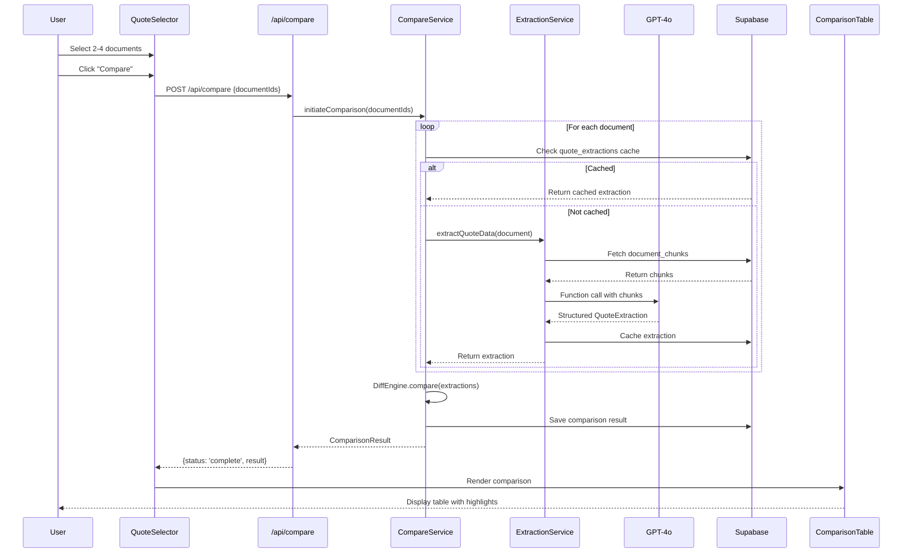

# Detailed Design

## Services and Modules

| Module | Responsibility | Location | Dependencies |
|--------|---------------|----------|--------------|
| **CompareService** | Orchestrates comparison workflow: document selection, extraction, diff generation | `src/lib/compare/service.ts` | ExtractionService, DiffEngine |
| **ExtractionService** | GPT-4o function calling for structured data extraction from chunks | `src/lib/compare/extraction.ts` | OpenAI client, document_chunks |
| **DiffEngine** | Computes differences, identifies gaps/conflicts, determines best/worst values | `src/lib/compare/diff.ts` | Pure functions, no external deps |
| **CompareAPI** | REST endpoints for compare operations | `src/app/api/compare/route.ts` | CompareService, auth middleware |
| **QuoteSelectionUI** | Document selection interface with upload integration | `src/components/compare/quote-selector.tsx` | DocumentList, UploadZone |
| **ComparisonTableUI** | Renders comparison table with highlighting | `src/components/compare/comparison-table.tsx` | DiffEngine output |
| **ComparisonHistoryUI** | History table with search, filtering, bulk actions | `src/components/compare/comparison-history.tsx` | CompareAPI list endpoint |
| **HistoryFiltersUI** | Search input, date range, presets | `src/components/compare/comparison-history-filters.tsx` | Client-side filtering |
| **ExportService** | PDF and CSV generation | `src/lib/compare/export.ts` | react-pdf, Blob API |

**Module Interaction Flow:**
```
QuoteSelectionUI → CompareAPI → CompareService
                                    ↓
                            ExtractionService (per doc)
                                    ↓
                              DiffEngine
                                    ↓
                            ComparisonTableUI
                                    ↓
                            ExportService (on demand)
```

## Data Models and Contracts

### Database Schema

```sql
-- Quote extraction cache (avoids re-extraction)
CREATE TABLE quote_extractions (
  id UUID PRIMARY KEY DEFAULT gen_random_uuid(),
  document_id UUID NOT NULL REFERENCES documents(id) ON DELETE CASCADE,
  agency_id UUID NOT NULL REFERENCES agencies(id),
  extracted_data JSONB NOT NULL,  -- QuoteExtraction type
  extraction_version INTEGER DEFAULT 1,  -- For schema migrations
  created_at TIMESTAMPTZ DEFAULT now(),
  updated_at TIMESTAMPTZ DEFAULT now(),
  UNIQUE(document_id, extraction_version)
);

-- Comparison sessions
CREATE TABLE comparisons (
  id UUID PRIMARY KEY DEFAULT gen_random_uuid(),
  agency_id UUID NOT NULL REFERENCES agencies(id),
  user_id UUID NOT NULL REFERENCES users(id),
  document_ids UUID[] NOT NULL,  -- Array of 2-4 document IDs
  comparison_data JSONB NOT NULL,  -- ComparisonResult type
  created_at TIMESTAMPTZ DEFAULT now()
);

-- RLS Policies
ALTER TABLE quote_extractions ENABLE ROW LEVEL SECURITY;
ALTER TABLE comparisons ENABLE ROW LEVEL SECURITY;

CREATE POLICY "Users can access own agency extractions"
  ON quote_extractions FOR ALL
  USING (agency_id = (SELECT agency_id FROM users WHERE id = auth.uid()));

CREATE POLICY "Users can access own agency comparisons"
  ON comparisons FOR ALL
  USING (agency_id = (SELECT agency_id FROM users WHERE id = auth.uid()));
```

### TypeScript Types

```typescript
// src/types/compare.ts

// GPT-4o function calling schema
interface QuoteExtraction {
  carrierName: string | null;
  namedInsured: string | null;
  effectiveDate: string | null;  // ISO date
  expirationDate: string | null;
  annualPremium: number | null;
  coverages: CoverageItem[];
  exclusions: ExclusionItem[];
  extractionConfidence: number;  // 0-1
}

interface CoverageItem {
  type: CoverageType;
  limit: number | null;
  limitType: 'per_occurrence' | 'aggregate' | 'per_person' | 'combined_single';
  deductible: number | null;
  sourceRef: SourceReference;
}

type CoverageType =
  | 'general_liability'
  | 'property'
  | 'auto_liability'
  | 'auto_physical_damage'
  | 'umbrella'
  | 'workers_comp'
  | 'professional_liability'
  | 'cyber'
  | 'other';

interface ExclusionItem {
  description: string;
  category: 'flood' | 'earthquake' | 'pollution' | 'mold' | 'cyber' | 'employment' | 'other';
  sourceRef: SourceReference;
}

interface SourceReference {
  pageNumber: number;
  textExcerpt: string;  // 100-200 chars
  chunkId: string;
}

// Comparison result
interface ComparisonResult {
  documents: DocumentSummary[];
  rows: ComparisonRow[];
  gaps: GapWarning[];
  conflicts: ConflictWarning[];
  generatedAt: string;
}

interface ComparisonRow {
  field: string;
  fieldType: 'coverage_limit' | 'deductible' | 'premium' | 'date' | 'text' | 'exclusion';
  values: CellValue[];  // One per document
  hasDifference: boolean;
  bestIndex: number | null;   // Index of best value (null if N/A)
  worstIndex: number | null;  // Index of worst value
}

interface CellValue {
  displayValue: string;
  rawValue: number | string | null;
  sourceRef: SourceReference | null;
  status: 'found' | 'not_found' | 'inferred';
}

interface GapWarning {
  field: string;
  documentsMissing: number[];  // Indices
  documentsPresent: number[];
  severity: 'high' | 'medium' | 'low';
}

interface ConflictWarning {
  field: string;
  description: string;
  documentIndices: number[];
  severity: 'high' | 'medium';
}
```

## APIs and Interfaces

### REST API Endpoints

```typescript
// POST /api/compare
// Initiates comparison for selected documents
interface CompareRequest {
  documentIds: string[];  // 2-4 UUIDs
}

interface CompareResponse {
  comparisonId: string;
  status: 'processing' | 'complete' | 'failed';
  result?: ComparisonResult;
  error?: { code: string; message: string };
}

// GET /api/compare/:id
// Retrieves existing comparison (for polling or reload)
// Response: CompareResponse

// GET /api/compare/:id/export?format=pdf|csv
// Generates and returns export file
// Response: Blob (application/pdf or text/csv)

// GET /api/compare - List comparisons (Story 7.7)
// Query params:
//   ?page=1&limit=20          - Pagination (default: page=1, limit=20)
//   ?search=filename          - Search document filenames
//   ?from=2024-01-01          - Date range start (ISO date)
//   ?to=2024-12-31            - Date range end (ISO date)
interface ListComparisonResponse {
  comparisons: ComparisonSummary[];
  totalCount: number;
  page: number;
  totalPages: number;
}

interface ComparisonSummary {
  id: string;
  createdAt: string;
  status: 'processing' | 'complete' | 'partial' | 'failed';
  documentCount: number;
  documentNames: string[];  // Filenames from joined documents table
}

// DELETE /api/compare/[id] - Single delete (Story 7.7)
// Deletes a single comparison by ID
// Response: { success: true }

// DELETE /api/compare - Bulk delete (Story 7.7)
// Request body: { ids: string[] }
// Response: { success: true, deletedCount: number }

// GET /api/documents/:id/extraction
// Get cached extraction for single document (or trigger if not cached)
interface ExtractionResponse {
  documentId: string;
  extraction: QuoteExtraction | null;
  status: 'cached' | 'processing' | 'failed';
  cachedAt?: string;
}
```

### GPT-4o Function Calling Schema

```typescript
// Used in ExtractionService for structured output
const extractQuoteDataFunction = {
  name: 'extract_quote_data',
  description: 'Extract structured insurance quote data from document content',
  parameters: {
    type: 'object',
    properties: {
      carrierName: { type: 'string', description: 'Insurance carrier/company name' },
      namedInsured: { type: 'string', description: 'Policyholder name' },
      effectiveDate: { type: 'string', description: 'Policy effective date (YYYY-MM-DD)' },
      expirationDate: { type: 'string', description: 'Policy expiration date (YYYY-MM-DD)' },
      annualPremium: { type: 'number', description: 'Total annual premium in USD' },
      coverages: {
        type: 'array',
        items: {
          type: 'object',
          properties: {
            type: { type: 'string', enum: ['general_liability', 'property', 'auto_liability', ...] },
            limit: { type: 'number', description: 'Coverage limit in USD' },
            limitType: { type: 'string', enum: ['per_occurrence', 'aggregate', 'per_person', 'combined_single'] },
            deductible: { type: 'number', description: 'Deductible in USD' },
            pageNumber: { type: 'integer', description: 'Page where this coverage is defined' },
            sourceText: { type: 'string', description: 'Exact text from document (100-200 chars)' }
          },
          required: ['type', 'limit', 'pageNumber', 'sourceText']
        }
      },
      exclusions: {
        type: 'array',
        items: {
          type: 'object',
          properties: {
            description: { type: 'string', description: 'Exclusion description' },
            category: { type: 'string', enum: ['flood', 'earthquake', 'pollution', 'mold', 'cyber', 'employment', 'other'] },
            pageNumber: { type: 'integer' },
            sourceText: { type: 'string' }
          },
          required: ['description', 'category', 'pageNumber']
        }
      }
    },
    required: ['carrierName', 'coverages']
  }
};
```

### Component Props

```typescript
// QuoteSelector component
interface QuoteSelectorProps {
  onCompare: (documentIds: string[]) => void;
  maxSelections?: number;  // Default 4
  minSelections?: number;  // Default 2
}

// ComparisonTable component
interface ComparisonTableProps {
  result: ComparisonResult;
  onCellClick: (documentIndex: number, field: string, sourceRef: SourceReference) => void;
  onExport: (format: 'pdf' | 'csv') => void;
}

// GapWarningBanner component
interface GapWarningBannerProps {
  gaps: GapWarning[];
  conflicts: ConflictWarning[];
  onGapClick: (gap: GapWarning) => void;  // Scroll to row
}
```

## Workflows and Sequencing

### Comparison Flow Sequence Diagram



### Extraction Flow Detail

```
1. Fetch all document_chunks for document (ordered by page, chunk_index)
2. Concatenate chunk content into context window (~400K tokens max with GPT-5.1)
3. Build extraction prompt:
   - System: "You are an insurance document analyst..."
   - User: Document content + "Extract quote data per schema"
   - Tools: [extractQuoteDataFunction with CFG constraints]
4. Call GPT-5.1 with tool_choice: { type: 'function', function: { name: 'extract_quote_data' } }
5. Parse function response as QuoteExtraction
6. Validate required fields present
7. Cache in quote_extractions table
8. Return extraction with source references
```

### Gap Detection Algorithm

```typescript
function detectGaps(extractions: QuoteExtraction[]): GapWarning[] {
  const gaps: GapWarning[] = [];
  const allCoverageTypes = new Set<CoverageType>();

  // Collect all coverage types across all quotes
  extractions.forEach(e => e.coverages.forEach(c => allCoverageTypes.add(c.type)));

  // Check each type for gaps
  allCoverageTypes.forEach(type => {
    const present = extractions.map((e, i) =>
      e.coverages.some(c => c.type === type) ? i : -1
    ).filter(i => i >= 0);

    const missing = extractions.map((_, i) => i).filter(i => !present.includes(i));

    if (missing.length > 0 && present.length > 0) {
      gaps.push({
        field: formatCoverageType(type),
        documentsMissing: missing,
        documentsPresent: present,
        severity: getCoverageSeverity(type)  // 'high' for GL, property; 'medium' for others
      });
    }
  });

  return gaps;
}
```

### Best/Worst Value Logic

| Field Type | Best = | Worst = |
|------------|--------|---------|
| Coverage Limit | Highest | Lowest |
| Deductible | Lowest | Highest |
| Premium | Lowest | Highest |
| Exclusion Count | Fewest | Most |

Values marked `not_found` are excluded from best/worst comparison.
