```mermaid
graph LR
    A[Land on App] --> B{Has Documents?}
    B -->|No| C[Upload Zone]
    B -->|Yes| D[Select Document]
    C --> E[Drop/Select PDF]
    E --> F[Processing ~10s]
    F --> D
    D --> G[Split View: Doc + Chat]
    G --> H[Type Question]
    H --> I[Streaming Response]
    I --> J[See Answer + Source]
    J --> K{Verify?}
    K -->|Yes| L[Click Source → Highlight in Doc]
    K -->|No| M[Ask Follow-up]
    L --> M
    M --> H
```

```mermaid
graph LR
    A[Click Compare] --> B[Upload Zone for Quotes]
    B --> C[Add Quote 1]
    C --> D[Add Quote 2]
    D --> E{More Quotes?}
    E -->|Yes| F[Add Quote 3-4]
    E -->|No| G[Process & Extract]
    F --> G
    G --> H[Comparison Table]
    H --> I[Review Differences]
    I --> J{Verify Value?}
    J -->|Yes| K[Click Source → View in Doc]
    J -->|No| L[Export PDF]
```

# docuMINE UX Design Specification

_Created on 2025-11-24 by Sam_
_Generated using BMad Method - Create UX Design Workflow v1.0_

---

## Executive Summary

**Project:** docuMINE - an AI-powered document analysis platform for independent insurance agents that solves the industry's trust problem with AI.

**Vision:** Agents need AI efficiency but can't trust generic tools with client-facing work because of accuracy concerns and E&O liability exposure. docuMINE delivers speed they can feel AND accuracy they can verify.

**Target Users:** Non-tech-savvy independent agency staff who:
- Have been in insurance for years ("old school" professionals)
- Work with 15+ carriers, each with different formats
- Are skeptical of new technology - they've been burned before
- Need tools that "just work" with zero learning curve
- Value their expertise and want AI to assist, not replace them

**The Magic Moment:** An agent asks "Is flood covered?" and gets the answer in seconds with a direct link to the exact policy language.

**MVP Capabilities:**
1. Document Chat / Q&A with source citations + confidence scoring
2. Side-by-Side Quote Comparison with auto-extraction and gap identification
3. Core Platform (signup, agency accounts, document storage)

**Design Philosophy:** "Invisible Technology" - tools that just work without training, tutorials, or feature tours. Trust through transparency.

---

## 1. Design System Foundation

### 1.1 Design System Choice

**Selected:** shadcn/ui

**Rationale:**
- Clean, professional aesthetic that matches the Microsoft Fluent-inspired direction
- Highly customizable via Tailwind CSS - easy to dial in exact look and feel
- Modern, well-maintained, excellent developer experience
- Popular with AI/LLM products - ChatGPT-style patterns work beautifully
- 40+ accessible components out of the box
- Copy-paste model means full ownership of code (no dependency lock-in)

**What shadcn/ui Provides:**
- Button, Input, Dialog, Card, Table, Tabs, Toast, Dropdown, etc.
- Dark/light mode theming built-in
- Fully accessible (WCAG compliant)
- Consistent spacing, typography, and color systems
- Animation primitives via Radix UI

**Customization Needed:**
- Theme colors tuned to docuMINE brand (professional blues/grays)
- AI chat components (conversation thread, streaming responses)
- Source citation badges/links
- Confidence indicator styling
- Document viewer with highlight support
- Quote comparison table with diff highlighting

**Technology Stack Alignment:**
- Built on Radix UI primitives (accessibility)
- Styled with Tailwind CSS (rapid customization)
- Works with React/Next.js (modern web stack)

---

## 2. Core User Experience

### 2.1 Core Experience Definition

**Two Equal Pillars:**
1. **Document Q&A** - Upload → Ask → Get answer with source citation
2. **Quote Comparison** - Upload multiple quotes → See side-by-side differences

Both are equally weighted - agents need both capabilities daily.

**What Must Be Effortless:** Query speed. The moment between asking a question and getting an answer must feel instant. No waiting, no spinning, no "processing..." messages that make them doubt.

**Critical Interaction to Nail:** The AI response experience. It must feel like talking to a knowledgeable coworker - natural, conversational, helpful. If it feels "weird" or robotic or overly formal, agents will abandon it.

**Platform:** Web application (browser-based)
- No installation required
- Works on any device
- No IT involvement needed
- Chosen specifically for non-tech-savvy audience

### 2.3 Desired Emotional Response

**The docuMINE Feeling:** Professional Empowerment

Users should feel:
1. **Empowered and in control** - "I've got this" - The tool amplifies their expertise, doesn't replace it
2. **Confident and capable** - "I can trust this" - They know the answers are right because they can verify them
3. **Efficient and productive** - "I'm getting so much done" - Real time savings they can feel

**What this means for design:**
- Clean, professional aesthetic (not playful or flashy)
- Speed is a feature - every interaction should feel instant
- Transparency builds trust - always show sources, never hide the "how"
- Respect their expertise - collaborative language, not authoritative
- No friction, no cleverness - just competent assistance

**The Analogy:** Like having a really sharp junior associate who always has the right document pulled up and speaks plainly.

### 2.4 Inspiration Analysis

**Reference Apps:** ChatGPT, Microsoft Copilot, Microsoft 365 Suite

These choices reveal users are comfortable with:

**ChatGPT:**
- Zero learning curve - open it, type, get answer
- Clean, focused interface - just the conversation
- Conversational flow - feels natural, like texting a smart friend
- Minimal UI chrome - content takes center stage

**Microsoft Copilot:**
- AI embedded in familiar tools, not a separate app
- Conversational UX as core interaction model
- Collapsible/minimal navigation - reduces cognitive load
- Trust signals built in - citations, sources, transparency
- "Nearly invisible" design - AI runs seamlessly in background

**Microsoft 365 / Fluent UI:**
- Familiar patterns users live in all day
- Clean, natural, consistent design
- Professional, not flashy - subtle, approachable
- Things stay where users expect them

**UX Patterns to Apply:**

| Pattern | Application |
|---------|-------------|
| Conversation-first | Chat interface as primary interaction |
| Familiarity | Microsoft-like feel and patterns |
| Minimal chrome | Strip away everything non-essential |
| Speed perception | Responses stream/build visibly |
| Trust through transparency | Always show sources |
| Professional tone | Clean, natural, not trendy |

**Design Direction:** Microsoft Fluent-inspired aesthetic - clean, professional, immediately comfortable for this audience.

### 2.5 Defining Experience

**The One-Liner:** "AI that actually works for insurance. Fast, reliable, accurate. Super easy to use."

This captures the three trust barriers docuMINE breaks through:
1. **"Actually works"** - Unlike generic AI tools that burned them before
2. **"Fast, reliable, accurate"** - The trifecta they've been told is impossible
3. **"Super easy to use"** - No learning curve, no complexity

**Standard Patterns Apply:**
The core interactions (document upload, chat Q&A, comparison tables) follow established UX patterns:
- Document upload: Drag-drop or click (standard file upload)
- Chat interface: ChatGPT-style conversation (proven pattern)
- Comparison: Side-by-side table with highlighting (standard comparison UX)
- Authentication: Standard login/signup flows

**No Novel Interaction Mechanics Needed:**
Unlike apps that invented new interactions (Tinder's swipe, Snapchat's disappearing content), docuMINE uses familiar patterns. The innovation is in the *output* (verified, cited answers) not the *interaction*.

**UX Focus:** Make the familiar patterns feel exceptionally fast, trustworthy, and effortless.

### 2.6 Core Experience Principles

| Principle | Definition | Example |
|-----------|------------|---------|
| **Speed** | Every interaction should feel instant. If something takes time, show progress immediately. | Response text streams in (like ChatGPT), not spinner → full answer |
| **Guidance** | Minimal - users are experts. Get out of their way. No tutorials, tooltips, or hand-holding. | Empty state just says "Upload a document or ask a question" |
| **Flexibility** | Low - constrained to prevent errors. Clear paths, not open canvases. | One way to upload, one way to ask, one way to compare |
| **Feedback** | Subtle but trustworthy. Confidence indicators, source links. Never celebratory. | Small badge for [High Confidence], not confetti or animations |

**The Speed Principle in Detail:**
- Text streams in character-by-character (perceived speed)
- Source citation appears as soon as found (not after full response)
- No loading spinners longer than 200ms - use skeleton/shimmer instead
- Document upload shows progress immediately (not "processing...")
- Comparison extraction shows each field as it's found

**The Trust Principle in Detail:**
- Conversational language: "I found..." not "The answer is..."
- Honest uncertainty: "I'm not seeing that in this document" not silence
- Always cite: Every claim links to source, no exceptions
- Understated confidence: High confidence is the default, only call out when uncertain

### 2.7 Project Understanding Summary

| Aspect | Summary |
|--------|---------|
| **Vision** | AI-powered document analysis that solves the trust problem - speed AND accuracy |
| **Users** | Old-school insurance agents who need tools that "just work" - skeptical of tech, experts in their field |
| **Core Experience** | Two equal pillars: Document Q&A and Quote Comparison |
| **Desired Feeling** | Professional empowerment: Empowered + Confident + Efficient |
| **Platform** | Web application, browser-based |
| **Inspiration** | ChatGPT (conversation flow), Copilot (trust signals), Microsoft 365 (familiar comfort) |
| **Design Direction** | Microsoft Fluent-inspired - clean, professional, minimal, familiar |
| **Critical to Nail** | AI responses must feel like talking to a coworker - natural, not weird |

**UX Complexity:** Moderate
- Standard patterns for: authentication, document management, comparison tables
- Novel pattern needed: conversational AI with inline source citations and confidence scoring

### 2.6 Novel UX Patterns

**Pattern: Conversational AI with Verifiable Responses**

This is docuMINE's defining UX challenge - making AI responses feel like a coworker conversation while maintaining trust through transparency.

**Standard AI Chat Patterns (from ChatGPT/Copilot):**
- Streaming text responses (builds trust through perceived speed)
- Conversational history in thread format
- Simple text input at bottom of screen
- Follow-up questions in natural flow

**Novel Pattern Required: Trust-Transparent Responses**

Each AI response must include:
1. **Natural Language Answer** - conversational, helpful, like a coworker
2. **Source Citation** - clickable link to exact document location
3. **Confidence Indicator** - [High Confidence] / [Needs Review] / [Not Found]

The challenge: integrate these trust elements WITHOUT making responses feel robotic or cluttered.

**Design Approach:**
- Answer text is primary - reads naturally
- Source citation is subtle but always present (small link/badge)
- Confidence indicator is understated for high confidence, more prominent for "Needs Review"
- Clicking source opens document viewer with highlighted passage

---

## 3. Visual Foundation

### 3.1 Color System

**Selected Theme:** Trustworthy Slate

**Personality:** Understated, serious, reliable. Feels like a trusted advisor, not a flashy app.

**Why This Theme:**
- Matches the "professional empowerment" emotional goal
- Doesn't scream "tech startup" - appeals to conservative, skeptical audience
- Slate tones convey reliability and seriousness
- Cyan accent provides subtle visual interest without being flashy
- Feels like enterprise software they can trust

**Primary Palette:**

| Role | Color | Hex | Usage |
|------|-------|-----|-------|
| Primary | Slate | `#475569` | Buttons, links, key actions |
| Primary Hover | Dark Slate | `#334155` | Hover states |
| Primary Light | Light Slate | `#f1f5f9` | Backgrounds, highlights |
| Secondary | Cool Gray | `#94a3b8` | Secondary actions, borders |
| Accent | Cyan | `#0891b2` | Links, interactive elements |

**Semantic Colors:**

| Role | Color | Hex | Usage |
|------|-------|-----|-------|
| Success | Emerald | `#059669` | High confidence, success states |
| Warning | Amber | `#d97706` | Needs review, caution states |
| Error | Red | `#dc2626` | Errors, destructive actions |

**Neutral Scale:**

| Role | Color | Hex | Usage |
|------|-------|-----|-------|
| Background | White | `#ffffff` | Page background |
| Surface | Off-white | `#f8fafc` | Cards, panels |
| Border | Light gray | `#e2e8f0` | Dividers, borders |
| Text | Near-black | `#0f172a` | Primary text |
| Text Muted | Gray | `#64748b` | Secondary text, captions |

### 3.2 Typography System

**Font Stack:** System fonts for maximum familiarity and performance

```css
font-family: -apple-system, BlinkMacSystemFont, 'Segoe UI', Roboto, Oxygen, Ubuntu, sans-serif;
```

**Type Scale:**

| Level | Size | Weight | Usage |
|-------|------|--------|-------|
| H1 | 24px | 600 | Page titles |
| H2 | 20px | 600 | Section headers |
| H3 | 16px | 600 | Card titles |
| Body | 14px | 400 | Primary content |
| Small | 13px | 400 | Secondary content |
| Caption | 12px | 400 | Labels, badges |
| Tiny | 11px | 500 | Confidence badges |

**Line Heights:** 1.5 for body text, 1.3 for headings

### 3.3 Spacing System

**Base Unit:** 4px

**Scale:**

| Token | Value | Usage |
|-------|-------|-------|
| xs | 4px | Tight spacing, badge padding |
| sm | 8px | Icon gaps, small padding |
| md | 16px | Standard padding, margins |
| lg | 24px | Section spacing |
| xl | 32px | Large gaps |
| 2xl | 48px | Page sections |

### 3.4 Layout Grid

- **Container max-width:** 1280px
- **Columns:** 12-column grid
- **Gutter:** 24px
- **Responsive breakpoints:**
  - Mobile: < 640px
  - Tablet: 640px - 1024px
  - Desktop: > 1024px

**Interactive Visualizations:**

- Color Theme Explorer: [ux-color-themes.html](./ux-color-themes.html)

---

## 4. Design Direction

### 4.1 Chosen Design Approach

**Primary Direction:** Hybrid of #3 (Split View) + #1 (Sidebar Chat)

**Core Layout Philosophy:**
The interface is built around two things: the document and the conversation. Nothing else competes for attention.

**Layout Structure:**

```
┌─────────────────────────────────────────────────────────────┐
│  Logo                              [Compare]  [User Menu]   │
├──────────────┬──────────────────────┬───────────────────────┤
│              │                      │                       │
│  SIDEBAR     │   DOCUMENT VIEWER    │     CHAT PANEL        │
│              │                      │                       │
│  Recent      │   • PDF rendered     │   • Conversation      │
│  Documents   │   • Highlighted      │   • Source citations  │
│              │     passages         │   • Confidence badges │
│  • Doc 1     │   • Page navigation  │                       │
│  • Doc 2     │                      │   ┌─────────────────┐ │
│  • Doc 3     │                      │   │ Ask question... │ │
│              │                      │   └─────────────────┘ │
│  [+ Upload]  │                      │                       │
└──────────────┴──────────────────────┴───────────────────────┘
```

**Why This Approach:**

1. **Split View (#3)** - Document and chat side-by-side
   - Users can verify answers instantly by seeing the source
   - Builds trust through transparency
   - Highlighted passages link directly to AI responses
   - "Show me the proof" is one click away

2. **Sidebar Navigation (#1)** - Document list always accessible
   - Familiar ChatGPT-style pattern
   - Easy document switching without losing context
   - Recent documents visible at a glance
   - Upload always accessible

3. **Minimal Empty State (#8 influence)** - When no document selected
   - Simple upload zone
   - "Drop a document or select from recent"
   - Zero friction to get started

**Screen States:**

| State | Layout |
|-------|--------|
| No documents | Centered upload zone (minimal) |
| Document selected | Split view: Document + Chat |
| Compare mode | Full-width comparison table |
| Mobile | Tabbed: Document / Chat (swipe) |

**What We're NOT Doing:**
- No dashboard with widgets
- No analytics or metrics views
- No complex navigation hierarchies
- No feature tours or onboarding flows

**Interactive Mockups:**

- Design Direction Showcase: [ux-design-directions.html](./ux-design-directions.html)

---

## 5. User Journey Flows

### 5.1 Critical User Paths

#### Journey 1: Document Q&A (Primary Flow)

**User Goal:** Get a quick, accurate answer about a policy document

**Flow:**



**Step-by-Step:**

| Step | User Action | System Response | Key UX Element |
|------|-------------|-----------------|----------------|
| 1 | Lands on app | Show recent docs or upload zone | Immediate clarity on what to do |
| 2 | Drops PDF file | "Analyzing document..." with progress | Skeleton/shimmer, not spinner |
| 3 | Document ready | Split view appears | Document on left, chat on right |
| 4 | Types "Is flood covered?" | Input accepts, send button activates | Simple text input, Enter to send |
| 5 | Waits ~2-3s | Text streams in word-by-word | Perceived speed through streaming |
| 6 | Reads answer | Answer + [High Confidence] badge + "View source →" | Trust elements visible but subtle |
| 7 | Clicks source | Document scrolls, passage highlighted in yellow | Instant verification |
| 8 | Asks follow-up | Conversation continues naturally | Context preserved |

**Error States:**
- Upload fails → "Couldn't process this file. Try a different PDF?" + retry button
- Question unclear → "I'm not sure what you're asking. Could you rephrase?"
- Not found → "I couldn't find information about that in this document." [Not Found badge]

---

#### Journey 2: Quote Comparison

**User Goal:** Compare multiple carrier quotes side-by-side

**Flow:**



**Step-by-Step:**

| Step | User Action | System Response | Key UX Element |
|------|-------------|-----------------|----------------|
| 1 | Clicks "Compare" | Upload zone for multiple quotes | Clear "Add quote" affordance |
| 2 | Drops first quote | "Quote 1 added" + extraction starts | Shows carrier name if detected |
| 3 | Drops second quote | "Quote 2 added" + "Add more or Compare" | Can add up to 4 |
| 4 | Clicks "Compare" | Extraction progress per field | Fields appear as extracted |
| 5 | Views table | Side-by-side comparison | Best/worst highlighting |
| 6 | Clicks value | Source document opens, value highlighted | Same verification pattern |
| 7 | Clicks "Export" | PDF generated with comparison | One-click export |

**Comparison Table Features:**
- Auto-extracted fields: Coverage types, limits, deductibles, exclusions, premium
- Green highlight: Best value in row
- Red highlight: Worst value or gaps
- "View source" on every cell
- Sortable by any column

---

#### Journey 3: First-Time User

**User Goal:** Understand what docuMINE does and try it

**Flow:**

| Step | Screen | User Sees | Key Principle |
|------|--------|-----------|---------------|
| 1 | Landing | Logo + "Drop a document to get started" | Zero explanation needed |
| 2 | Upload | Drag-drop zone + recent docs (empty) | One clear action |
| 3 | Processing | "Analyzing your document..." | Progress visible |
| 4 | Ready | Split view with placeholder chat | "Ask anything about this document" |
| 5 | First query | Types question, gets answer | Magic moment |
| 6 | Trust built | Sees source citation, clicks it | Verification cements trust |

**No onboarding tour. No feature explanation. Just: upload → ask → see proof.**

---

#### Journey 4: Returning User

**User Goal:** Continue work on recent documents

| Step | Screen | User Sees | Key Principle |
|------|--------|-----------|---------------|
| 1 | Landing | Sidebar with recent documents | Instant recognition |
| 2 | Select | Clicks document name | One click to context |
| 3 | Resume | Previous conversation visible | Context preserved |
| 4 | Continue | Asks new question | Seamless continuation |

---

## 6. Component Library

### 6.1 Component Strategy

**Base:** shadcn/ui components (40+ accessible components)

**Standard Components (Use As-Is):**
- Button, Input, Textarea
- Dialog, Dropdown, Popover
- Table, Tabs, Toast
- Card, Avatar, Badge
- Tooltip, Skeleton

### 6.2 Custom Components Needed

#### ChatMessage

**Purpose:** Display AI responses with trust elements

**Anatomy:**
```
┌─────────────────────────────────────────┐
│ [Avatar] Message text that streams in   │
│          word by word as response       │
│          is generated...                │
│                                         │
│ [✓ High Confidence]  View source →      │
└─────────────────────────────────────────┘
```

**States:**
- Streaming (text appearing)
- Complete (full response + citation)
- Error (failed to respond)

**Variants:**
- User message (right-aligned, primary color bubble)
- AI message (left-aligned, surface color, with citations)

---

#### ConfidenceBadge

**Purpose:** Indicate AI confidence level

**Variants:**

| Variant | Appearance | Usage |
|---------|------------|-------|
| High Confidence | `✓` + green bg (#d1fae5) | Default, most responses |
| Needs Review | `⚠` + amber bg (#fef3c7) | Uncertain or conflicting info |
| Not Found | `○` + gray bg (#f1f5f9) | Information not in document |

**Behavior:**
- High Confidence: Subtle, doesn't demand attention
- Needs Review: Slightly more prominent, draws eye
- Not Found: Neutral, informational

---

#### SourceCitation

**Purpose:** Link AI response to exact document location

**Anatomy:**
```
View in document → (clickable link)
```

**Behavior:**
- Click → Document viewer scrolls to location
- Passage highlighted with yellow background (#fef08a)
- Highlight fades after 3 seconds

---

#### DocumentViewer

**Purpose:** Render PDF with interactive highlighting

**Features:**
- PDF rendering (pdf.js or similar)
- Page navigation
- Zoom controls (optional, minimal)
- Text selection
- Highlight support (yellow background for cited passages)
- Scroll-to-location API

**States:**
- Loading (skeleton)
- Ready (PDF visible)
- Highlighted (passage marked)
- Error (failed to load)

---

#### ComparisonTable

**Purpose:** Side-by-side quote comparison with highlighting

**Anatomy:**
```
┌──────────┬───────────┬───────────┬───────────┐
│ Coverage │ Hartford  │ Travelers │ Liberty   │
├──────────┼───────────┼───────────┼───────────┤
│ Limit    │ $1M  ●    │ $1M       │ $500K  ○  │
│ Deduct   │ $5K       │ $2.5K  ●  │ $10K   ○  │
│ Premium  │ $4,200    │ $4,800 ○  │ $3,900 ●  │
└──────────┴───────────┴───────────┴───────────┘
● = Best in row (green)  ○ = Worst in row (red)
```

**Features:**
- Auto-highlights best/worst values
- Each cell has "View source" link
- Sortable columns
- Export to PDF

---

#### UploadZone

**Purpose:** Drag-and-drop file upload

**States:**
- Default: Dashed border, "Drop a document here"
- Hover: Border color change, background highlight
- Uploading: Progress bar or percentage
- Processing: "Analyzing document..." with shimmer
- Complete: Transitions to document view
- Error: Red border, error message

---

#### DocumentListItem

**Purpose:** Sidebar document entry

**Anatomy:**
```
┌────────────────────────────┐
│ 📄 Hartford_GL_Quote.pdf   │
│    Uploaded 2 hours ago    │
└────────────────────────────┘
```

**States:**
- Default
- Hover (background highlight)
- Selected (left border accent, darker background)
- Processing (shimmer/loading indicator)

---

## 7. UX Pattern Decisions

### 7.1 Consistency Rules

These patterns ensure a consistent experience across all screens.

#### Button Hierarchy

| Type | Style | Usage |
|------|-------|-------|
| Primary | Solid slate (#475569), white text | Main action per screen (Send, Compare, Upload) |
| Secondary | Outline, slate border | Supporting actions (View Document, Export) |
| Ghost | Text only, slate color | Tertiary actions (Cancel, Back) |
| Destructive | Solid red (#dc2626), white text | Delete, Remove (always with confirmation) |

**Rule:** One primary button per view. Never two competing primary actions.

---

#### Feedback Patterns

| Feedback Type | Pattern | Duration |
|---------------|---------|----------|
| Success | Toast (bottom-right), green accent | 3 seconds, auto-dismiss |
| Error | Toast (bottom-right), red accent | Persistent until dismissed |
| Warning | Inline alert, amber accent | Persistent |
| Info | Inline or toast, slate accent | Context-dependent |
| Loading (< 200ms) | No indicator | — |
| Loading (> 200ms) | Skeleton shimmer | Until complete |
| Loading (> 2s) | Progress indicator | Until complete |

**Rule:** Never show a spinner for less than 200ms. Use skeleton states for content loading.

---

#### Form Patterns

| Element | Pattern |
|---------|---------|
| Labels | Above input, 13px, medium weight |
| Required fields | No indicator (assume all required unless stated optional) |
| Optional fields | "(optional)" suffix on label |
| Validation timing | On blur for format, on submit for required |
| Error display | Inline below field, red text, 12px |
| Help text | Below input, muted text, 12px |

**Rule:** Forms are minimal. Only ask for what's needed.

---

#### Modal Patterns

| Aspect | Pattern |
|--------|---------|
| Size | Small (400px) for confirms, Medium (600px) for forms |
| Dismiss | Click outside, Escape key, or explicit close button |
| Focus | Auto-focus first interactive element |
| Stacking | Never stack modals. Close current before opening new. |

**Rule:** Modals are rare. Prefer inline interactions where possible.

---

#### Navigation Patterns

| Element | Pattern |
|---------|---------|
| Active state | Left border accent + darker background (sidebar) |
| Breadcrumbs | Not used (flat navigation) |
| Back button | Browser back works naturally |
| Deep linking | All views are URL-addressable |

**Rule:** Navigation is minimal. Sidebar + top bar only.

---

#### Empty State Patterns

| Context | Pattern |
|---------|---------|
| No documents | Centered upload zone with clear CTA |
| No search results | "No documents match your search" + clear search button |
| No conversation | "Ask anything about this document" placeholder |
| Error loading | "Something went wrong" + retry button |

**Rule:** Empty states guide action. Never leave users stranded.

---

#### Confirmation Patterns

| Action | Confirmation |
|--------|--------------|
| Delete document | Modal: "Delete [filename]? This can't be undone." |
| Leave unsaved | None (auto-save everything) |
| Logout | None (one-click logout) |
| Export | None (one-click export) |

**Rule:** Only confirm destructive, irreversible actions.

---

#### Notification Patterns

| Type | Placement | Behavior |
|------|-----------|----------|
| Transient (success, info) | Bottom-right toast | Auto-dismiss 3s |
| Persistent (error) | Bottom-right toast | Manual dismiss |
| Contextual (form errors) | Inline | Persistent until fixed |

**Rule:** Notifications are minimal and unobtrusive.

---

#### AI Response Language

| Situation | Language Pattern |
|-----------|------------------|
| Found answer | "I found..." / "The policy states..." / "According to..." |
| Uncertain | "I'm not certain, but..." / "This might be..." |
| Not found | "I couldn't find information about that in this document." |
| Error | "I had trouble processing that. Could you try again?" |

**Rule:** Conversational, helpful, like a coworker. Never robotic or overly formal.

---

## 8. Responsive Design & Accessibility

### 8.1 Responsive Strategy

**Target Devices:**
- Primary: Desktop (1024px+) - where agents do most work
- Secondary: Tablet (640px - 1024px) - occasional use
- Tertiary: Mobile (< 640px) - quick lookups only

#### Breakpoint Behavior

| Breakpoint | Layout | Navigation | Key Changes |
|------------|--------|------------|-------------|
| Desktop (1024px+) | Three-panel: Sidebar + Document + Chat | Sidebar always visible | Full split view |
| Tablet (640-1024px) | Two-panel: Document + Chat | Sidebar collapsible (hamburger) | Narrower panels |
| Mobile (< 640px) | Single panel with tabs | Bottom tab bar | Tab: Document / Chat |

#### Desktop Layout (Primary)

```
┌──────────┬─────────────────┬──────────────┐
│ Sidebar  │   Document      │    Chat      │
│ (240px)  │   (flexible)    │   (360px)    │
└──────────┴─────────────────┴──────────────┘
```

#### Tablet Layout

```
┌──────────────────┬──────────────┐
│    Document      │    Chat      │
│    (60%)         │    (40%)     │
└──────────────────┴──────────────┘
[≡] Hamburger → Sidebar overlay
```

#### Mobile Layout

```
┌────────────────────────┐
│    [Document] [Chat]   │  ← Tab bar
├────────────────────────┤
│                        │
│   Active Tab Content   │
│                        │
└────────────────────────┘
```

#### Responsive Adaptations

| Element | Desktop | Tablet | Mobile |
|---------|---------|--------|--------|
| Sidebar | Always visible | Collapsible overlay | Hidden (bottom nav) |
| Split view | Side-by-side | Side-by-side (narrower) | Tabbed |
| Chat input | Full width | Full width | Fixed bottom |
| Document viewer | Full height | Full height | Full screen |
| Comparison table | Full table | Horizontal scroll | Card view per quote |

---

### 8.2 Accessibility Strategy

**Target:** WCAG 2.1 Level AA

This level is the industry standard and covers most accessibility needs without being impractical.

#### Color & Contrast

| Requirement | Implementation |
|-------------|----------------|
| Text contrast | Minimum 4.5:1 for body text, 3:1 for large text |
| UI contrast | Minimum 3:1 for interactive elements |
| Color independence | Never use color alone to convey information |
| Focus indicators | Visible 2px outline on all interactive elements |

**Trustworthy Slate palette passes AA contrast:**
- Text (#0f172a) on white: 15.5:1 ✓
- Primary (#475569) on white: 5.9:1 ✓
- Muted text (#64748b) on white: 4.6:1 ✓

#### Keyboard Navigation

| Requirement | Implementation |
|-------------|----------------|
| All interactive elements | Focusable via Tab key |
| Focus order | Logical left-to-right, top-to-bottom |
| Skip links | "Skip to main content" link (hidden until focused) |
| Modal focus trap | Focus stays within modal when open |
| Escape key | Closes modals, dropdowns, popovers |

#### Screen Reader Support

| Requirement | Implementation |
|-------------|----------------|
| Semantic HTML | Proper heading hierarchy (h1 → h2 → h3) |
| ARIA labels | All interactive elements have accessible names |
| Live regions | AI responses announced as they stream |
| Alt text | Meaningful descriptions for all images |
| Form labels | Properly associated with inputs |

#### Specific Accessibility Considerations

| Feature | Accessibility Approach |
|---------|------------------------|
| Chat messages | `role="log"` + `aria-live="polite"` for new messages |
| Confidence badges | Text + icon (not icon alone) |
| Document highlights | Yellow bg + underline (color + style) |
| Loading states | `aria-busy="true"` + screen reader announcement |
| Source citations | Descriptive link text ("View in document, page 12") |

#### Touch Targets

| Requirement | Implementation |
|-------------|----------------|
| Minimum size | 44x44px for all touch targets |
| Spacing | Minimum 8px between adjacent targets |
| Mobile buttons | Full-width on mobile for easy tapping |

#### Testing Strategy

| Method | Tools |
|--------|-------|
| Automated | Lighthouse, axe DevTools, WAVE |
| Keyboard | Manual tab-through testing |
| Screen reader | VoiceOver (Mac), NVDA (Windows) |
| Color | Contrast checker, colorblind simulation |

---

## 9. Implementation Guidance

### 9.1 What We Created

| Deliverable | Description |
|-------------|-------------|
| **Design System** | shadcn/ui with 6 custom components |
| **Visual Foundation** | Trustworthy Slate color theme, system typography, 4px spacing |
| **Design Direction** | Hybrid Split View + Sidebar (verification-focused) |
| **User Journeys** | 4 flows: Q&A, Comparison, First-time, Returning |
| **UX Patterns** | 10 consistency rules covering all interactions |
| **Responsive Strategy** | 3 breakpoints with specific adaptations |
| **Accessibility** | WCAG 2.1 AA compliance requirements |

### 9.2 Key Design Decisions Summary

| Decision | Choice | Rationale |
|----------|--------|-----------|
| Design System | shadcn/ui | Modern, accessible, AI-product friendly |
| Color Theme | Trustworthy Slate | Professional, serious, trusted advisor feel |
| Primary Layout | Split View + Sidebar | Trust through verification, familiar pattern |
| AI Response Style | Coworker conversation | Natural, not robotic, builds trust |
| Loading Pattern | Streaming text | Perceived speed, builds confidence |
| Confidence Display | Subtle badges | Trust without clutter |
| Navigation | Minimal sidebar | Documents + Compare, nothing else |
| Mobile Strategy | Tabbed interface | Practical for quick lookups |

### 9.3 Implementation Priority

**Phase 1: Core Experience**
1. Document upload + processing
2. Split view layout (document + chat)
3. Chat interface with streaming responses
4. Source citations with document highlighting
5. Confidence badges

**Phase 2: Compare & Polish**
1. Quote comparison table
2. Multi-document upload
3. Export functionality
4. Responsive adaptations

**Phase 3: Refinement**
1. Accessibility audit and fixes
2. Performance optimization
3. Edge case handling
4. User feedback integration

### 9.4 Developer Handoff Notes

**Tech Stack Alignment:**
- React/Next.js recommended
- Tailwind CSS for styling
- shadcn/ui for component base
- pdf.js for document rendering
- Streaming API for AI responses

**Critical Implementation Details:**

1. **Streaming Responses:** Use Server-Sent Events or WebSocket for character-by-character streaming. Response should feel instant even if full answer takes 3-5 seconds.

2. **Source Citations:** Store exact document positions (page, coordinates) with each AI response. Clicking citation should smooth-scroll and highlight.

3. **Document Highlighting:** Temporary highlight (yellow #fef08a) that fades after 3 seconds. Should work with PDF text layer.

4. **Confidence Scoring:** Backend should return confidence level with each response. Display logic:
   - 90%+ → High Confidence (green)
   - 70-89% → Needs Review (amber)
   - <70% or not found → Not Found (gray)

5. **Conversation Context:** Maintain conversation history per document. Switching documents should preserve each document's conversation.

### 9.5 Quality Checklist

Before shipping each feature, verify:

- [ ] Works without mouse (keyboard only)
- [ ] Screen reader announces correctly
- [ ] Loading states feel fast (skeleton, not spinner)
- [ ] Error states guide recovery
- [ ] Mobile layout is usable
- [ ] Source citations link correctly
- [ ] Confidence badges display appropriately
- [ ] AI language sounds conversational

### 9.6 Completion Summary

**UX Design Specification Complete!**

**What was created:**
- Comprehensive UX specification for docuMINE
- Two interactive HTML deliverables (color themes, design directions)
- Complete component library with custom components
- User journey flows with error handling
- Responsive and accessibility strategies

**Your Deliverables:**
- `docs/ux-design-specification.md` (this document)
- `docs/ux-color-themes.html` (interactive color explorer)
- `docs/ux-design-directions.html` (8 design direction mockups)

**Next Steps:**
1. Run validation with `*validate-design` (optional)
2. Proceed to Architecture workflow
3. Or generate additional artifacts (wireframes, prototypes)

---

## Appendix

### Related Documents

- Product Requirements: `docs/prd.md`
- Product Brief: `docs/product-brief-docuMINE-2025-11-24.md`
- Domain Research: `docs/research-domain-comprehensive-2025-11-24.md`

### Core Interactive Deliverables

This UX Design Specification was created through visual collaboration:

- **Color Theme Visualizer**: docs/ux-color-themes.html
- **Design Direction Mockups**: docs/ux-design-directions.html

### Version History

| Date       | Version | Changes                         | Author |
| ---------- | ------- | ------------------------------- | ------ |
| 2025-11-24 | 1.0     | Initial UX Design Specification | Sam    |

---

_This UX Design Specification was created through collaborative design facilitation, not template generation. All decisions were made with user input and are documented with rationale._
