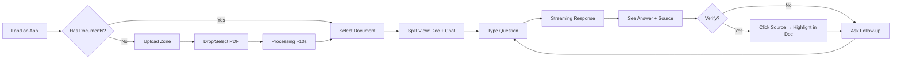
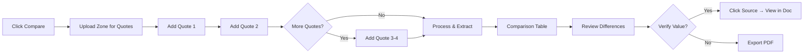

# 5. User Journey Flows

## 5.1 Critical User Paths

### Journey 1: Document Q&A (Primary Flow)

**User Goal:** Get a quick, accurate answer about a policy document

**Flow:**

**Step-by-Step:**

| Step | User Action | System Response | Key UX Element |
|------|-------------|-----------------|----------------|
| 1 | Lands on app | Show recent docs or upload zone | Immediate clarity on what to do |
| 2 | Drops PDF file | "Analyzing document..." with progress | Skeleton/shimmer, not spinner |
| 3 | Document ready | Split view appears | Document on left, chat on right |
| 4 | Types "Is flood covered?" | Input accepts, send button activates | Simple text input, Enter to send |
| 5 | Waits ~2-3s | Text streams in word-by-word | Perceived speed through streaming |
| 6 | Reads answer | Answer + [High Confidence] badge + "View source →" | Trust elements visible but subtle |
| 7 | Clicks source | Document scrolls, passage highlighted in yellow | Instant verification |
| 8 | Asks follow-up | Conversation continues naturally | Context preserved |

**Error States:**
- Upload fails → "Couldn't process this file. Try a different PDF?" + retry button
- Question unclear → "I'm not sure what you're asking. Could you rephrase?"
- Not found → "I couldn't find information about that in this document." [Not Found badge]

---

### Journey 2: Quote Comparison

**User Goal:** Compare multiple carrier quotes side-by-side

**Flow:**

**Step-by-Step:**

| Step | User Action | System Response | Key UX Element |
|------|-------------|-----------------|----------------|
| 1 | Clicks "Compare" | Upload zone for multiple quotes | Clear "Add quote" affordance |
| 2 | Drops first quote | "Quote 1 added" + extraction starts | Shows carrier name if detected |
| 3 | Drops second quote | "Quote 2 added" + "Add more or Compare" | Can add up to 4 |
| 4 | Clicks "Compare" | Extraction progress per field | Fields appear as extracted |
| 5 | Views table | Side-by-side comparison | Best/worst highlighting |
| 6 | Clicks value | Source document opens, value highlighted | Same verification pattern |
| 7 | Clicks "Export" | PDF generated with comparison | One-click export |

**Comparison Table Features:**
- Auto-extracted fields: Coverage types, limits, deductibles, exclusions, premium
- Green highlight: Best value in row
- Red highlight: Worst value or gaps
- "View source" on every cell
- Sortable by any column

---

### Journey 3: First-Time User

**User Goal:** Understand what docuMINE does and try it

**Flow:**

| Step | Screen | User Sees | Key Principle |
|------|--------|-----------|---------------|
| 1 | Landing | Logo + "Drop a document to get started" | Zero explanation needed |
| 2 | Upload | Drag-drop zone + recent docs (empty) | One clear action |
| 3 | Processing | "Analyzing your document..." | Progress visible |
| 4 | Ready | Split view with placeholder chat | "Ask anything about this document" |
| 5 | First query | Types question, gets answer | Magic moment |
| 6 | Trust built | Sees source citation, clicks it | Verification cements trust |

**No onboarding tour. No feature explanation. Just: upload → ask → see proof.**

---

### Journey 4: Returning User

**User Goal:** Continue work on recent documents

| Step | Screen | User Sees | Key Principle |
|------|--------|-----------|---------------|
| 1 | Landing | Sidebar with recent documents | Instant recognition |
| 2 | Select | Clicks document name | One click to context |
| 3 | Resume | Previous conversation visible | Context preserved |
| 4 | Continue | Asks new question | Seamless continuation |

---
